# Wiki Documentation for https://github.com/oc-andrey-zaharov/docs-central.git

Generated on: 2025-11-07 13:56:29

## Table of Contents

- [Overview](#page-1)
- [System Architecture](#page-2)
- [Core Features](#page-3)
- [Data Management and Flow](#page-4)
- [Documentation Standards](#page-5)
- [Deployment and Infrastructure](#page-6)
- [Extensibility and Customization](#page-7)

<a id='page-1'></a>

## Overview

### Related Pages

Related topics: [System Architecture](#page-2), [Core Features](#page-3)

<details>
  <summary>Relevant source files</summary>

  The following files were used as context for generating this wiki page:

  - [DOCS_STANDARDS.md]
  - [README.md]
  - [DOCS_GENERATION_GUIDE.md]
  - [DOCS_PORTING_GUIDE.md]
  - [AGENTS_TEMPLATE.md]
  - [projects/migration/overview.md]
  - [projects/migration/FETCHER_OVERVIEW.md]
  - [scripts/validate_docs.py]
  - [registry.yml]
</details>

# Overview

The docs-central repository serves as the centralized hub for all company documentation, standardizing Markdown-based files with Mermaid diagrams for consistency across projects. It enables LLM-assisted generation, version control via Git, and automated publishing to Confluence, ensuring secure, accessible, and maintainable documentation for developers, LLMs, and stakeholders. This system unifies legacy and new docs, supporting modular project structures through submodules while enforcing standards for clarity and automation.

The overview encompasses the repository's purpose in managing documentation lifecycles, from creation and validation to publishing, with a focus on automation via Cursor agents and CI pipelines. It integrates project-specific docs, such as the data migration example, to demonstrate real-world application.

## Repository Structure

The repository organizes documentation hierarchically, with core standards files at the root, project-specific submodules under `/projects/`, and supporting scripts for validation and publishing.

Key components include:
- Root-level guides like `DOCS_STANDARDS.md` for unified formatting.
- `projects/` directory housing submodules for domains like migration and sales.
- `scripts/` containing tools such as `validate_docs.py` for linting and `publish_confluence.sh` for deployment.

Configuration is managed via `registry.yml`, which registers projects with details like URLs, paths, and Confluence mappings.

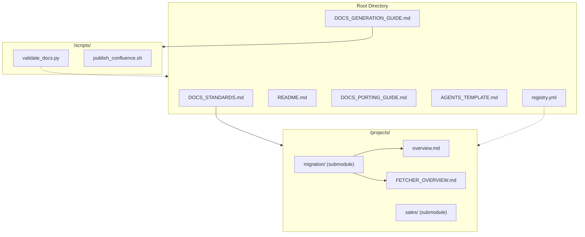

This flowchart illustrates the layout, with root files providing governance and projects enabling domain isolation.

## Documentation Standards

All documentation adheres to `DOCS_STANDARDS.md`, mandating UTF-8 Markdown with line widths ≤100 characters, specific file naming (lowercase with hyphens), and a structured template covering What, Why, How, and Who.

Required sections include Overview, Architecture/Flow, Key Components, Usage Examples, Dependencies, and Maintenance Notes. Mermaid diagrams must include ID comments and brief descriptions. Metadata at file ends specifies Last Updated, Maintainer, and Doc Version.

File naming conventions enforce `OVERVIEW.md`, `FLOW.md`, `RUNBOOK.md`, `API.md`, and `AGENTS.md` for main files.

```yaml
# Example metadata from standards
---
Last Updated: YYYY-MM-DD
Maintainer: @github-handle
Doc Version: vX.Y.Z
---
```

Validation via `validate_docs.py` checks metadata, Mermaid syntax, links, naming, and linting.

## Automated Generation Workflow

Documentation generation leverages Cursor agents triggered by pre-commit hooks, as detailed in `DOCS_GENERATION_GUIDE.md`. Agents detect code changes in files like `.py`, `.sh`, or `.js`, then propose updates to `.md` files following standards.

The workflow starts with code modification, invokes the agent with rules from `AGENTS.md`, generates patches in `/docs/_suggested.patch`, and applies them for review.

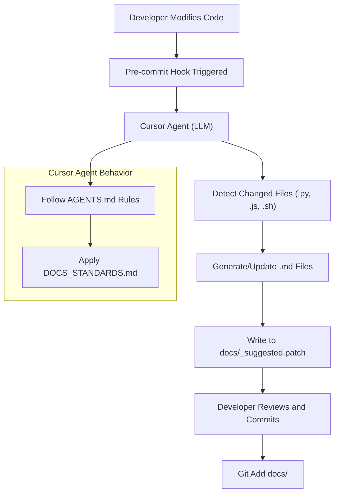

This process ensures docs stay synchronized with code, using commands like `# Add Documentation` for creation.

Example pre-commit hook script:

```bash
#!/usr/bin/env bash
set -e
CHANGED=$(git diff --cached --name-only | grep -E '\.(py|js|sh) || true')
[ -z "$CHANGED" ] && exit 0

cursor-agent --headless --rules AGENTS.md --input "$CHANGED" --out docs/_suggested.patch
git apply docs/_suggested.patch || true
git add docs
```

## Validation and Quality Checks

The `validate_docs.py` script enforces standards by checking individual files or directories recursively. It verifies metadata patterns, Mermaid ID comments, internal link integrity, file naming (lowercase-hyphens), and runs `markdownlint` if available.

For Mermaid blocks, it ensures non-empty content and ID comments like `%% data-pipeline-overview`. Broken links are flagged if internal paths do not exist.

```python
def check_metadata(file_path):
    """Check if file has required metadata at the end."""
    try:
        with open(file_path, 'r', encoding='utf-8') as f:
            content = f.read()
        
        # Check for metadata section
        metadata_pattern = r'\n---\nLast Updated: \d{4}-\d{2}-\d{2}\nMaintainer: @\w+\nDoc Version: v\d+\.\d+\.\d+\n---?$'
        return bool(re.search(metadata_pattern, content))
    except Exception as e:
        print(f"Error reading {file_path}: {e}")
        return False
```

Usage: `python validate_docs.py <path> --fix` for auto-fixes where possible. CI runs staleness checks on PRs, commenting on outdated docs like `docs/FLOW.md`.

## Publishing to Confluence

Merges to `main` trigger CI publishing via GitHub Actions (`markdown-confluence/publish-action`), using secrets like `ATLASSIAN_API_TOKEN` and `CONFLUENCE_SPACE_KEY`. Pages are locked under a parent ID, with bot-only edits.

`registry.yml` maps domains to spaces (e.g., data-engineering to DE). Mermaid handling preserves fenced blocks if the app is installed, or renders to SVG via `mermaid-cli`.

Publishing rules exclude drafts and enforce reviews. Source remains GitHub for version history.

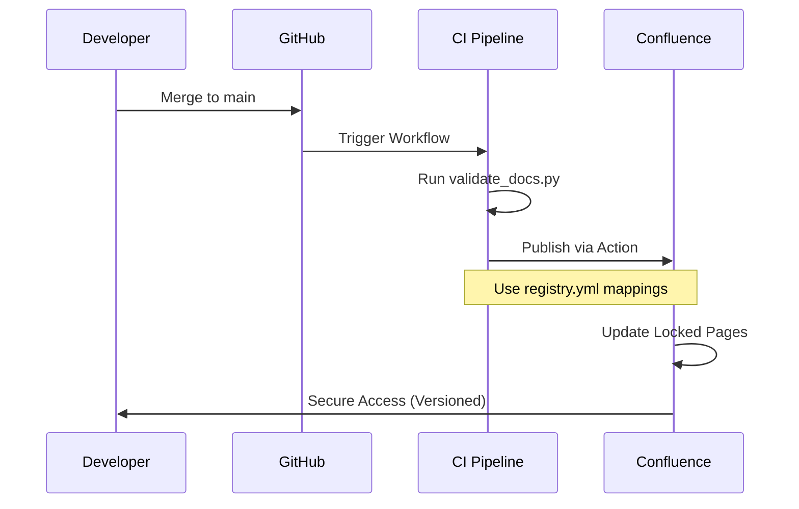

## Project Integration and Examples

New projects are added by creating `/docs/` with `AGENTS.md`, then registering via `./scripts/register-docs.sh <repo-url> <path>`. Submodules link repos like migration.

The migration project exemplifies structure: `overview.md` describes ETL components (Fetcher, Transformer, Loader) with dependencies like Python 3.9+ and Airflow.

Fetcher details extraction strategies (full/incremental/CDC), configuration in YAML, and usage like `./fetcher/run.sh --source legacy_erp --all-tables`.

```yaml
# fetcher-config.yml example
databases:
  legacy_erp:
    type: postgresql
    host: erp.legacy.com
    port: 5432
    database: erp_prod
    username: ${DB_USER}
    password: ${DB_PASSWORD}
    
extraction:
  strategy: incremental
  timestamp_column: updated_at
  batch_size: 10000
```

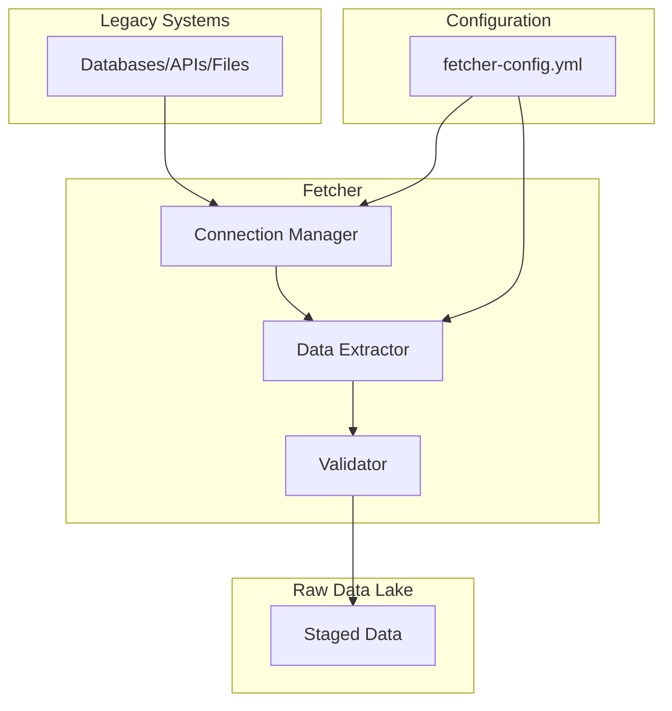

## Legacy Porting Process

`DOCS_PORTING_GUIDE.md` outlines migration: inventory sources (Confluence/Google Docs), convert via tools like Pandoc, standardize with sections and Mermaid, validate, integrate as submodules, and review.

Classification tags docs as ACTIVE/STATIC/DEPRECATED. Run `make validate-docs` for checks including linting and metadata.

| Source | Conversion Tool | Notes |
|--------|-----------------|-------|
| Confluence | Atlassian REST API → Markdown via `confluence-exporter` or Pandoc | Preserve headings, remove inline CSS |
| Google Docs | Drive export API → `.docx` → Pandoc → `.md` | Keep tables and bullets |
| Legacy MD | Manual copy + linting | Apply new style |

## Agent Rules and Commands

`AGENTS_TEMPLATE.md` defines LLM behavior: reference docs first, combine context with comments, use Mermaid for flows, follow standards. Commands include `# Add Documentation` for generation and `# Validate Docs` for compliance.

File map links areas to docs like `docs/OVERVIEW.md` for high-level info.

```mermaid
flowchart TD
    A["LLM Agent"] --> B["Consult /docs/"]
    B --> C["Rule 1: Reference Before Assumptions"]
    B --> D["Rule 2: Doc + Code Comments"]
    B --> E["Rule 3: Mermaid for Flows"]
    B --> F["Rule 4: Follow Standards"]

    subgraph system["Documentation System"]
        G["/docs/ (Primary)"]
        H["docs-central (Central)"]
        I["Confluence (Target)"]
    end

    C --> G
    D --> G
    E --> G
    F --> G
    G --> H
    H --> I

---

<a id='page-2'></a>

## System Architecture

### Related Pages

Related topics: [Overview](#page-1), [Data Management and Flow](#page-4)

<details>
  <summary>Relevant source files</summary>

  The following files were used as context for generating this wiki page:

  - [README.md]
  - [DOCS_STANDARDS.md]
  - [DOCS_GENERATION_GUIDE.md]
  - [AGENTS_TEMPLATE.md]
  - [DOCS_PORTING_GUIDE.md]
  - [registry.yml]
  - [scripts/validate_docs.py]
</details>

# System Architecture

The System Architecture of the docs-central repository establishes a centralized, version-controlled documentation platform for company projects. It unifies documentation in Markdown format with Mermaid diagrams, leveraging LLM automation via Cursor agents for generation and maintenance. The scope encompasses project-specific docs under submodules, automated workflows for updates and validation, and secure publishing to Confluence, ensuring consistency for developers, LLMs, and stakeholders. This architecture promotes portability, reduces staleness, and enforces standards across domains like data engineering and sales.

At a high level, the system integrates GitHub for source control, pre-commit hooks for LLM-driven doc generation, CI pipelines for validation and publishing, and Confluence for read-only access. It supports modular project integration via submodules and a registry for tracking, with rules defined for agents to maintain doc integrity.

## Core Components

The architecture revolves around key components: the central repository layout, documentation standards, agent integration, validation scripts, and publishing mechanisms. These ensure docs are generated, validated, and deployed systematically.

### Repository Layout and Structure

The root structure organizes global standards, project submodules, and scripts for automation.

```mermaid
flowchart TD
    subgraph repo["docs-central Repository"]
        standards["DOCS_STANDARDS.md<br/>Standards"]
        guides["DOCS_GENERATION_GUIDE.md<br/>Generation Guide"]
        template["AGENTS_TEMPLATE.md<br/>Agent Rules"]
        registry["registry.yml<br/>Project Registry"]
        scripts["scripts/<br/>validate_docs.py"]
        projects["projects/<br/>Submodules"]
    end

    standards --> guides
    guides --> template
    template --> registry
    registry --> projects
    projects --> scripts
```

This layout centralizes standards while allowing project independence through submodules, as seen in the README.md repository diagram. Projects like migration are added under `projects/migration/`, with docs like `overview.md` and component-specific files.

Key elements include:
- Global files: Standards, guides, and templates enforce uniformity.
- Project submodules: Enable per-project docs without bloating the central repo.
- Scripts: Handle validation and registration.

Configuration in `registry.yml` tracks projects with fields like URL, path, status, and domain, e.g.:

```yaml
projects:
  migration:
    url: https://github.com/company/migration.git
    path: migration
    registered: 2025-11-04T00:00:00Z
    status: active
    description: Data migration system with fetcher, transformer, and loader components
    domain: data-engineering
    contact: @migration-team
```

Domains map to Confluence spaces, such as `data-engineering: DE`.

### Documentation Standards and Content Rules

Standards define file conventions, structure, and LLM-friendly guidelines to ensure consistency.

Every document follows a template with sections like Overview, Architecture/Flow, Key Components, Usage Examples, Dependencies, and Maintenance Notes. Metadata is required at the bottom:

```
---
Last Updated: YYYY-MM-DD
Maintainer: @github-handle
Doc Version: vX.Y.Z
```

File naming uses lowercase with hyphens (e.g., `data-flow.md`), and content must address What, Why, How, and Who. Mermaid diagrams require ID comments, e.g.:

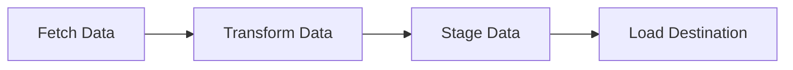

This enforces readability for LLMs and humans, with line width ≤100 characters and UTF-8 Markdown.

## Workflow and Automation

The system automates doc lifecycle through pre-commit hooks, CI checks, and publishing, integrating LLM agents for generation.

### Generation and Update Workflow

Cursor agents, guided by `AGENTS_TEMPLATE.md`, generate docs on code changes. Rules include referencing docs before assumptions and using Mermaid for flows.

```mermaid
flowchart TD
    A["Developer Modifies Code"] --> B["Pre-commit Hook<br/>Triggered"]
    B --> C["Cursor Agent<br/>(LLM)"]
    C --> D["Propose Doc Updates<br/>docs/_suggested.patch"]
    D --> E["Developer Reviews<br/>and Commits"]
    E --> F["Push to Git"]
    F --> G["CI Pipeline<br/>Triggered"]
    G --> H["Staleness Check"]
    G --> I["Validation<br/>validate_docs.py"]
    I --> J["Merge to main"]
    J --> K["Confluence Publish<br/>GitHub Action"]
    K --> L["Locked Confluence Pages"]
    H -.-> E : Comment if stale
```

The pre-commit hook example from `DOCS_GENERATION_GUIDE.md`:

```bash
#!/usr/bin/env bash
set -e
CHANGED=$(git diff --cached --name-only | grep -E '\.(py|js|sh) || true')
[ -z "$CHANGED" ] && exit 0

cursor-agent --headless --rules AGENTS.md --input "$CHANGED" --out docs/_suggested.patch
git apply docs/_suggested.patch || true
git add docs
```

Agents use commands like `# Add Documentation` to create sections following standards. For updates, they regenerate affected parts while preserving context.

### Validation Process

Validation ensures compliance via `scripts/validate_docs.py`, checking metadata, Mermaid syntax, links, naming, and linting.

Key functions:
- `check_metadata(file_path)`: Verifies pattern for Last Updated, Maintainer, Doc Version.
- `check_mermaid_syntax(file_path)`: Scans for ID comments in blocks.
- `check_markdown_links(file_path)`: Detects broken internal links.
- `check_file_naming(file_path)`: Enforces lowercase-hyphens.
- `lint_markdown(file_path)`: Runs external markdownlint if available.

Usage:

```bash
python scripts/validate_docs.py .
```

The script walks directories, validates .md files, and exits with status. For directories:

```python
def validate_directory(directory):
    md_files = []
    for root, dirs, files in os.walk(directory):
        for file in files:
            if file.endswith('.md'):
                md_files.append(os.path.join(root, file))
    # ... validation loop
```

Issues are reported, e.g., "Missing or invalid metadata".

CI runs staleness checks on PRs, commenting on outdated docs like "Potentially stale documentation detected in: docs/FLOW.md".

## Publishing and Integration

Publishing to Confluence is CI-triggered on main merges, using secrets like `ATLASSIAN_API_TOKEN`.

### Project Registration and Porting

New projects register via `./scripts/register-docs.sh <repo-url> <path>`, updating `registry.yml`. Submodules add via `git submodule add <repo-url> projects/<domain>/<repo-name>`.

For legacy migration (`DOCS_PORTING_GUIDE.md`):
1. Inventory sources (Confluence, Google Docs).
2. Convert using tools like Pandoc.
3. Standardize with sections and Mermaid.
4. Validate with `make validate-docs`.
5. Integrate as submodule and publish.

Publishing config in `registry.yml`:

```yaml
confluence:
  base_url: ${ATLASSIAN_BASE_URL}
  space_mappings:
    data-engineering: DE
    sales: SALES
    default: DOC
publishing:
  auto_publish: true
  stale_check_days: 30
  required_reviewers: 1
  exclude_patterns:
    - "*/drafts/*"
    - "*/temp/*"
    - "*.draft.md"
```

Mermaid handling: Preserve fenced blocks if app installed, else render to SVG via mermaid-cli. Security ensures only CI bot edits Confluence, with GitHub as source of truth.

## Project Example: Migration Domain

As an active domain in `registry.yml`, the migration project illustrates architecture application. Its `overview.md` uses the standard template with Mermaid for data flow.

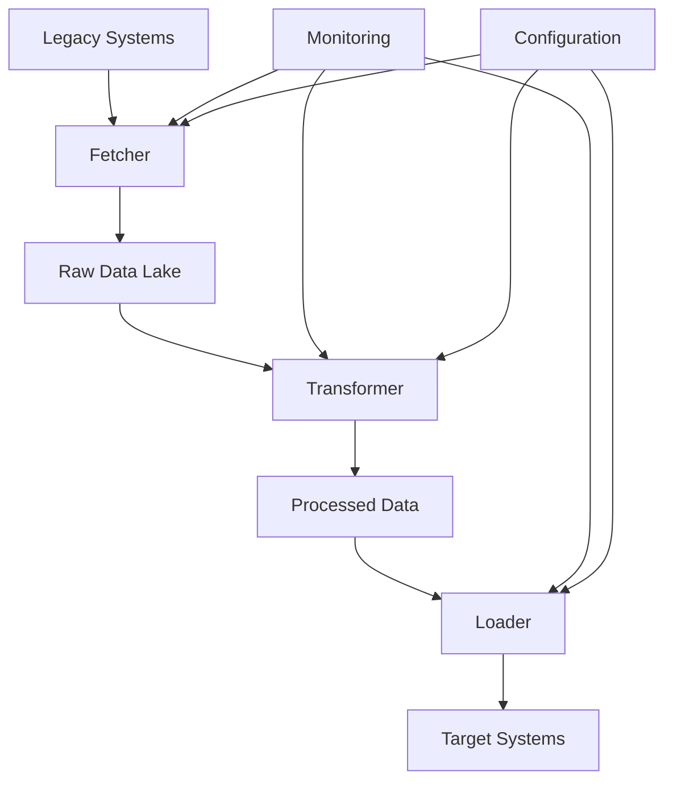

Fetcher details in `FETCHER_OVERVIEW.md` include config YAML and usage:

```yaml
# fetcher-config.yml
databases:
  legacy_erp:
    type: postgresql
    host: erp.legacy.com
    port: 5432
    database: erp_prod
    username: ${DB_USER}
    password: ${DB_PASSWORD}
    
extraction:
  strategy: incremental
  timestamp_column: updated_at
  batch_size: 10000
```

This modular approach scales to other domains like sales.

---

<a id='page-3'></a>

## Core Features

### Related Pages

Related topics: [Overview](#page-1), [Documentation Standards](#page-5)

<details>
  <summary>Relevant source files</summary>

  The following files were used as context for generating this wiki page:

  - [README.md]
  - [DOCS_STANDARDS.md]
  - [DOCS_GENERATION_GUIDE.md]
  - [DOCS_PORTING_GUIDE.md]
  - [AGENTS_TEMPLATE.md]
  - [registry.yml]
</details>

# Core Features

The Core Features of the docs-central repository establish a centralized, automated system for managing company documentation. This system unifies documentation across projects in Markdown format with Mermaid diagrams, leveraging LLM automation via Cursor for generation and maintenance. It ensures consistency, version control, and secure publishing to Confluence, serving developers, LLMs, and non-technical stakeholders. The scope encompasses standards enforcement, automated workflows, legacy migration, and project registration, promoting a single source of truth in GitHub while restricting edits to reviewed CI processes.

Key aspects include modular project structures, pre-commit hooks for doc updates, validation scripts, and registry management, all designed to minimize staleness and enhance accessibility.

## Documentation Standards and Structure

The system enforces unified documentation standards to maintain consistency across all projects. Every document must address what it does, why it exists, how it works, and who it affects, using a standardized Markdown template.

### File Conventions
- Files use UTF-8 Markdown with line widths ≤ 100 characters.
- Fenced code blocks for code (e.g., ```python) and Mermaid diagrams (```mermaid).
- Naming uses lowercase with hyphens (e.g., data-flow.md).
- Standard files include OVERVIEW.md for purpose, FLOW.md for processes, RUNBOOK.md for operations, API.md for interfaces, and AGENTS.md for agent rules.

### Content Structure Template
Documents follow this structure:

```markdown
# Title
## Overview
## Architecture / Flow
## Key Components
## Usage Examples
## Dependencies
## Maintenance Notes
```

### Mermaid Standards
Diagrams include brief descriptions and ID comments (e.g., %% id). This ensures referenceability and LLM compatibility.

The following diagram illustrates the standard document structure:

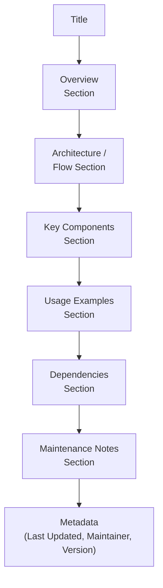

### LLM-Friendly Guidelines
- Descriptive headers and short sentences.
- Explicit keywords (functions, files).
- Code snippets for logic description.
- No undefined slang.

### Versioning and Metadata
Each document ends with YAML-like metadata:

```
---
Last Updated: YYYY-MM-DD
Maintainer: @github-handle
Doc Version: vX.Y.Z
```

## Automated Generation Workflow

Core to the system is LLM-assisted documentation generation using Cursor agents triggered by code changes. This feature ensures docs evolve with the codebase, reducing manual effort.

### Cursor Agent Behavior
Agents detect modified files (.py, .sh, .js) and generate/update .md files per DOCS_STANDARDS.md. Outputs go to /docs/_suggested.patch for review.

Entry command example:

```
# Add Documentation
Add comprehensive documentation for the current code/feature and format it according to the project's documentation standards.
```

### Pre-Commit Hook
A bash hook runs on commits:

```bash
#!/usr/bin/env bash
set -e
CHANGED=$(git diff --cached --name-only | grep -E '\.(py|js|sh) || true')
[ -z "$CHANGED" ] && exit 0

cursor-agent --headless --rules AGENTS.md --input "$CHANGED" --out docs/_suggested.patch
git apply docs/_suggested.patch || true
git add docs
```

### PR Validation and Staleness Check
CI on pull requests detects code changes without doc updates, commenting on potential staleness (e.g., "Potentially stale documentation detected in: docs/FLOW.md").

The workflow is visualized below:

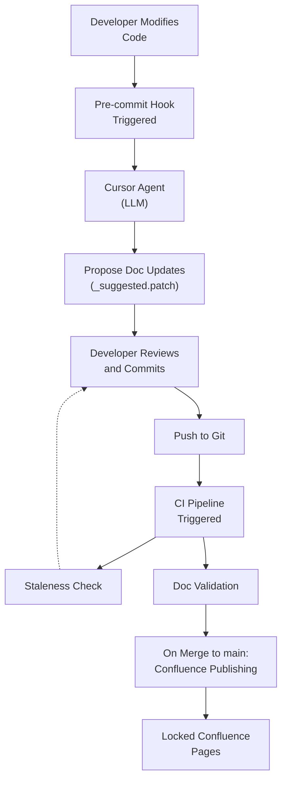

## Legacy Documentation Porting

Migration of existing docs from Confluence, Google Docs, or legacy Markdown to the central system is a core feature, ensuring unification under new standards.

### Phases
1. **Inventory:** Gather and classify docs as ACTIVE, STATIC, or DEPRECATED.
2. **Conversion:** Use tools like confluence-exporter, Pandoc for transformation.
   - Confluence: API to Markdown, remove CSS.
   - Google Docs: Export to .docx then Pandoc to .md.
   - Legacy MD: Manual linting.

3. **Standardization:** Apply DOCS_STANDARDS.md, add sections, Mermaid diagrams, metadata.
4. **Validation:** Run make validate-docs for linting, syntax, links, metadata.
5. **Integration:** Add as submodules, update registry.yml, trigger CI.
6. **Review:** Domain owner approval before publishing.

Conversion tools table:

| Source       | Conversion Tool          | Notes                          |
|--------------|--------------------------|--------------------------------|
| Confluence  | Atlassian REST API → Markdown via confluence-exporter or Pandoc | Preserve headings, remove inline CSS |
| Google Docs | Drive export API → .docx → Pandoc → .md | Keep tables and bullets |
| Legacy MD   | Manual copy + linting    | Apply new style                |

Porting flow:

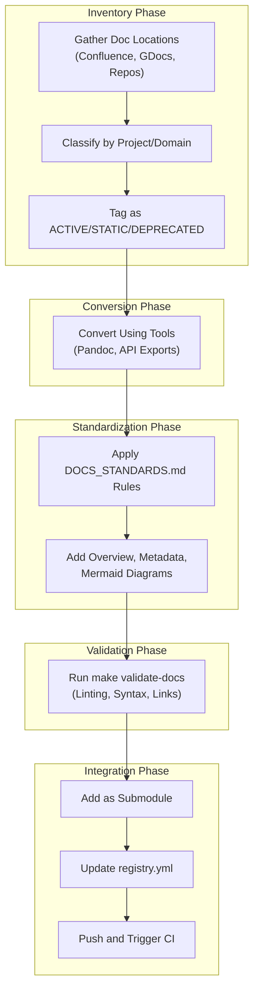

## Project Registration and Repository Layout

Projects are registered via scripts and organized modularly, with submodules for independence.

### Repository Structure
From README.md:

```
docs-central/
│
├── DOCS_STANDARDS.md
├── DOCS_GENERATION_GUIDE.md
├── DOCS_PORTING_GUIDE.md
├── AGENTS_TEMPLATE.md
├── projects/
│   ├── migration/
│   │   ├── overview.md
│   │   ├── fetcher/ (submodule)
│   │   ├── transformer/ (submodule)
│   │   └── loader/ (submodule)
│   └── sales/ (submodule)
│
└── scripts/
├── publish_confluence.sh
└── validate_docs.py
```

### Adding New Projects
1. Create /docs/ in project repo with AGENTS.md.
2. Register: ./scripts/register-docs.sh <repo-url> <path>
3. Commit to docs-central.

### Registry Management
registry.yml lists projects:

```yaml
projects:
  migration:
    url: https://github.com/company/migration.git
    path: migration
    registered: 2025-11-04T00:00:00Z
    status: active
    description: Data migration system with fetcher, transformer, and loader components
    domain: data-engineering
    contact: @migration-team
```

Domains and Confluence mappings are defined, with publishing rules like auto_publish: true and stale_check_days: 30.

Registration relationships:

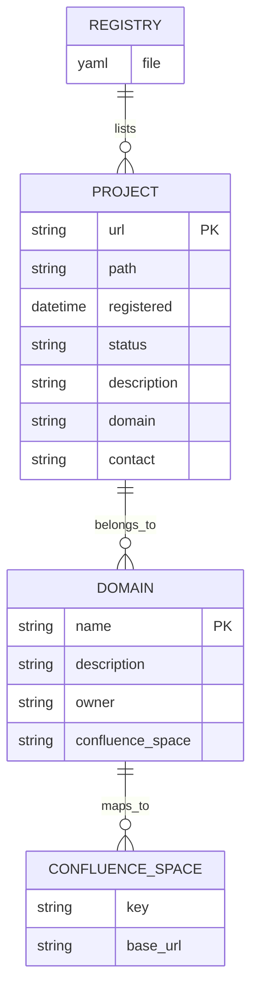

## Confluence Publishing and Security

Publishing to Confluence is automated on main merges, using GitHub Actions for secure, versioned access.

### Publishing Process
- Action: markdown-confluence/publish-action.
- Locked parent pages; bot-only edits.
- Secrets: ATLASSIAN_BASE_URL, API_TOKEN, etc.
- Mermaid: Preserved if app installed, else SVG via mermaid-cli.

### Security Features
- CI bot exclusive edits.
- GitHub as source of truth.
- Version history native to Git.

### Agent Integration Rules
From AGENTS_TEMPLATE.md, agents follow rules like referencing docs first and using Mermaid for flows. Commands include # Add Documentation, # Update Documentation, # Validate Docs.

Agent rules flow:

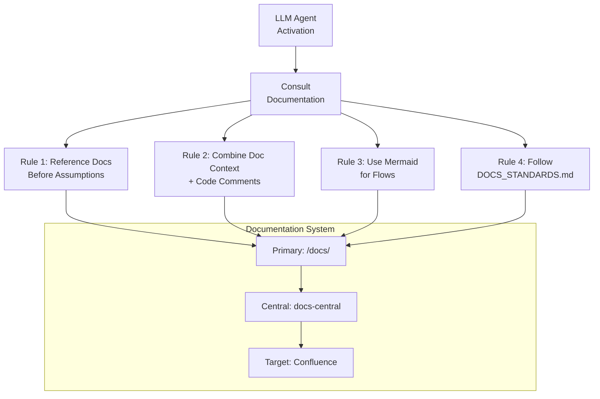

## Validation and Maintenance

The validate_docs.py script enforces standards across files.

### Key Functions
- check_metadata: Verifies end metadata pattern.
- check_mermaid_syntax: Ensures ID comments in blocks.
- check_markdown_links: Detects broken internal links.
- check_file_naming: Enforces lowercase-hyphens.
- lint_markdown: Runs markdownlint if available.
- validate_directory: Recursively checks all .md files.

Usage: python validate_docs.py <path> [--fix]

Example validation logic snippet from validate_file:

```python
def validate_file(file_path):
    """Validate a single markdown file."""
    print(f"Validating {file_path}...")
    
    issues = []
    
    if not check_metadata(file_path):
        issues.append("Missing or invalid metadata")
    
    if not check_mermaid_syntax(file_path):
        issues.append("Mermaid syntax issues")
    
    if not check_markdown_links(file_path):
        issues.append("Broken internal links")
    
    if not check_file_naming(file_path):
        issues.append("File naming convention issues")
    
    if not lint_markdown(file_path):
        issues.append("Markdown linting issues")
    
    if issues:
        print(f"  Issues found: {', '.join(issues)}")
        return False
    else:
        print("  ✓ All checks passed")
        return True
```

This comprehensive validation integrates with CI, ensuring high-quality docs before publishing.

---

<a id='page-4'></a>

## Data Management and Flow

### Related Pages

Related topics: [System Architecture](#page-2), [Deployment and Infrastructure](#page-6)

<details>
  <summary>Relevant source files</summary>

  The following files were used as context for generating this wiki page:

  - [projects/migration/overview.md]
  - [projects/migration/FETCHER_OVERVIEW.md]
  - [README.md]
  - [DOCS_GENERATION_GUIDE.md]
  - [registry.yml]
  - [AGENTS_TEMPLATE.md]
</details>

# Data Management and Flow

## Introduction

The Data Management and Flow in the docs-central repository encompasses the structured handling of documentation as data within the centralized system, with a focus on the migration project as a key example of data extraction, transformation, and loading processes. This system ensures that documentation is version-controlled, automated for generation and validation, and published securely to Confluence. The migration project specifically manages data from legacy systems to new infrastructure, using modular components to maintain data integrity and operational efficiency. This flow integrates with the broader repository workflow, where changes trigger documentation updates via LLM agents, ensuring consistency across projects like migration and sales.

The scope includes data flows for documentation generation, project-specific data pipelines (e.g., in migration), and registry management for tracking active projects. High-level oversight is provided through Mermaid diagrams in project overviews, while automation scripts and configurations enforce standards for data handling and flow.

## Overall Architecture

The architecture of data management in docs-central centralizes documentation in Markdown format, with submodules for project-specific data flows like the migration system. The repository layout organizes projects under `/projects/`, with scripts for validation and publishing. Key elements include LLM-assisted generation, CI/CD pipelines for staleness checks, and Confluence as the secure publishing target.

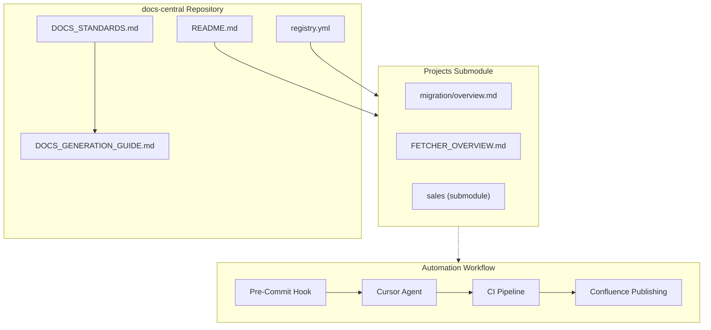

This flowchart illustrates the integration of standards, project documentation, and automated workflows. The migration project exemplifies data flow through its components, connecting to the central repository for unified management.

## Migration Project Data Flow

The migration project handles data management by extracting from legacy systems, transforming for compatibility, and loading into target systems. It uses a modular architecture with Fetcher, Transformer, and Loader components, orchestrated via Apache Airflow. Monitoring and configuration apply across all stages to ensure reliable flow.

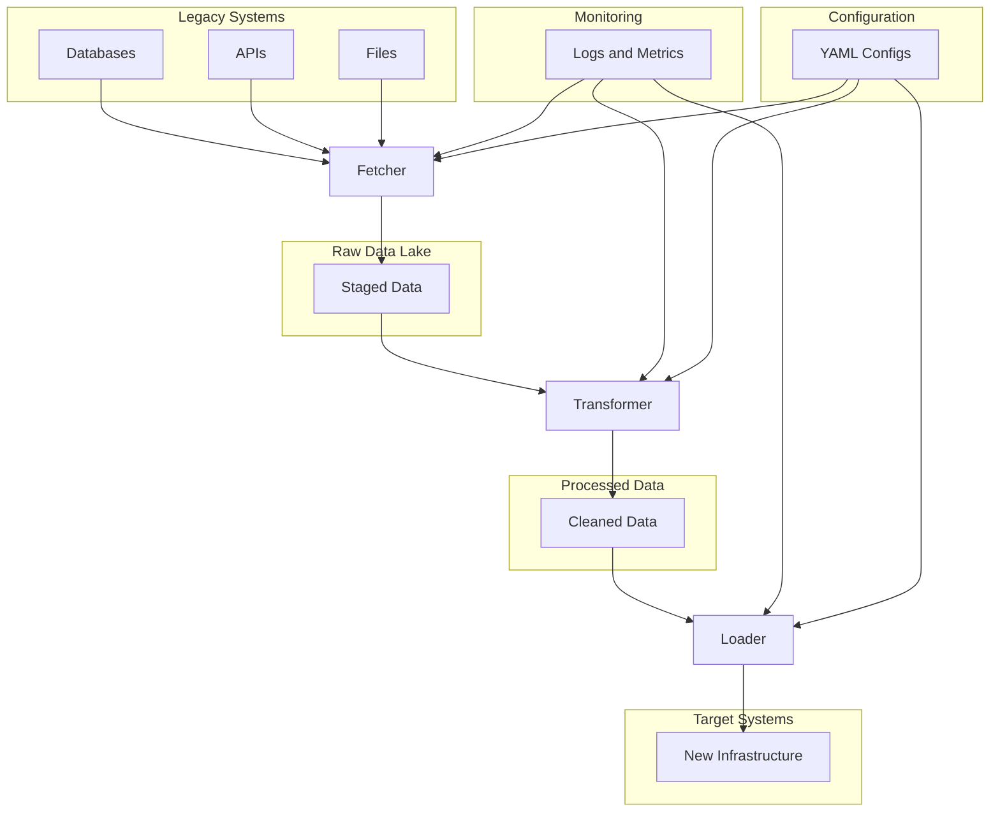

The diagram above depicts the end-to-end data flow in the migration project. Fetcher extracts raw data, Transformer applies rules, and Loader handles insertion, with cross-cutting concerns for monitoring and configuration.

### Fetcher Component

The Fetcher extracts data from diverse sources like databases, APIs, and files, managing connections and retries. It supports strategies such as full scans, incremental updates, and CDC. Validation occurs post-extraction to ensure integrity before staging in the raw data lake.

Key elements include:
- **Connection Manager**: Handles pooling, authentication, and retries.
- **Data Extractor**: Implements extraction strategies with batch sizing.
- **Validator**: Checks required fields and null percentages.

Configuration example from fetcher-config.yml:

```yaml
databases:
  legacy_erp:
    type: postgresql
    host: erp.legacy.com
    port: 5432
    database: erp_prod
    username: ${DB_USER}
    password: ${DB_PASSWORD}
    
extraction:
  strategy: incremental
  timestamp_column: updated_at
  batch_size: 10000
  
validation:
  required_fields: [id, created_at]
  max_null_percentage: 5
```

Usage:

```bash
./fetcher/run.sh --source legacy_erp --all-tables
./fetcher/run.sh --source legacy_erp --table users --where "updated_at > '2024-01-01'"
```

Error handling includes retries for transients and dead letter queues for failures.

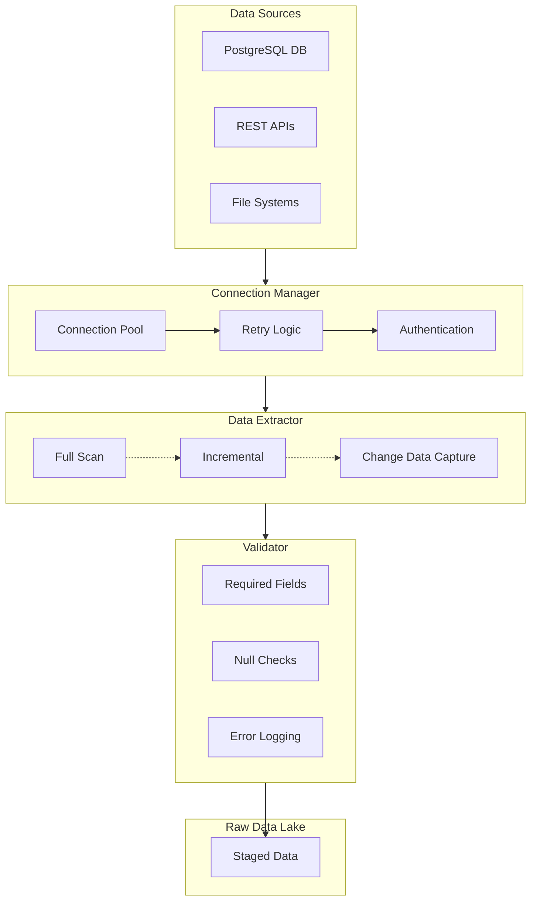

This flowchart details the internal flow within Fetcher, showing how sources connect through management layers to validation and storage.

### Transformer and Loader Components

The Transformer processes raw data by applying business rules, validations, and schema conversions. It cleanses data and prepares it for loading.

The Loader manages batch insertion into target systems, with transaction handling and rollback support.

From the migration overview, dependencies include Python 3.9+, PostgreSQL 13+, Airflow, and Redis.

Usage for full pipeline:

```bash
./scripts/run-migration.sh --config migration-config.yml
```

## Documentation Generation and Publishing Flow

Data management extends to documentation itself, treated as versioned data. The workflow uses pre-commit hooks to trigger Cursor agents for updates, followed by CI validation and Confluence publishing. The registry.yml tracks projects like migration, ensuring centralized flow.

```mermaid
flowchart TD
    A["Developer Modifies Code"] --> B["Pre-Commit Hook Triggered"]
    B --> C["Cursor Agent (LLM)"]
    C --> D["Propose Doc Updates (_suggested.patch)"]
    D --> E["Developer Reviews and Commits"]
    E --> F["Push to Git"]
    F --> G["CI Pipeline"]
    G --> H["Staleness Check"]
    G --> I["Validate Docs (validate_docs.py)"]
    I --> J["On Merge to main: Confluence Publish"]
    J --> K["Locked Confluence Pages"]

    H -.-> E : Comment if Stale
```

This sequence represents the automated documentation flow, ensuring data (docs) remains current. Agents reference AGENTS_TEMPLATE.md rules, such as using Mermaid for flows and following standards.

Registry entry for migration:

```yaml
projects:
  migration:
    url: https://github.com/company/migration.git
    path: migration
    registered: 2025-11-04T00:00:00Z
    status: active
    description: Data migration system with fetcher, transformer, and loader components
    domain: data-engineering
    contact: @migration-team
```

## Key Configurations and Validation

Validation ensures data flow integrity via scripts like validate_docs.py, checking metadata, Mermaid syntax, links, naming, and linting. Publishing uses GitHub Actions with secrets for Confluence.

Pre-commit hook example:

```bash
#!/usr/bin/env bash
set -e
CHANGED=$(git diff --cached --name-only | grep -E '\.(py|js|sh) || true')
[ -z "$CHANGED" ] && exit 0

cursor-agent --headless --rules AGENTS.md --input "$CHANGED" --out docs/_suggested.patch
git apply docs/_suggested.patch || true
git add docs
```

This maintains the flow from code changes to documented data management processes.

---

<a id='page-5'></a>

## Documentation Standards

### Related Pages

Related topics: [Core Features](#page-3), [Extensibility and Customization](#page-7)

<details>
  <summary>Relevant source files</summary>

  The following files were used as context for generating this wiki page:

  - [DOCS_STANDARDS.md]
  - [README.md]
  - [DOCS_GENERATION_GUIDE.md]
  - [AGENTS_TEMPLATE.md]
  - [DOCS_PORTING_GUIDE.md]
  - [scripts/validate_docs.py]
</details>

# Documentation Standards

The Documentation Standards define a unified approach for creating and maintaining documentation across all company projects. This ensures consistency in structure, tone, and accessibility for LLMs, developers, and non-technical stakeholders. By standardizing on Markdown with Mermaid diagrams, the system facilitates automated generation via Cursor agents, version control in GitHub, and secure publishing to Confluence. The standards integrate with the central repository at `docs-central`, promoting portability, LLM-assisted updates, and streamlined workflows as outlined in the repository's overall architecture.

These standards address key aspects of documentation lifecycle, from file conventions to validation and migration, ensuring all docs answer core questions: what it does, why it exists, how it works, and who it affects. They support submodule-based project independence while enforcing central compliance through pre-commit hooks and CI pipelines.

## Purpose and Scope

The primary goal is to create consistent, maintainable documentation that leverages Markdown for portability and Mermaid for visual flows. This applies to all projects under `docs-central`, including submodules like `projects/migration`. Scope covers file creation, content structuring, diagram standards, writing guidelines, versioning, review processes, and legacy porting.

Key benefits include LLM compatibility for automated updates, versioned access via Confluence, and reduced maintenance overhead through validation scripts.

## File Conventions

Documentation uses UTF-8 Markdown with a line width of ≤100 characters. Fenced code blocks handle code snippets (e.g., ```python), and ```mermaid blocks for diagrams.

File naming follows lowercase with hyphens (e.g., `data-flow.md`). Standard main files include:
- `OVERVIEW.md`: Project purpose and scope
- `FLOW.md`: Process flow and diagrams
- `RUNBOOK.md`: Operational guidance
- `API.md`: API or interface documentation
- `AGENTS.md`: Cursor rules and quick access info

The repository layout centralizes these under `docs-central/`, with projects as submodules (e.g., `projects/migration/`).

```mermaid
flowchart TD
    A["UTF-8 Markdown Files"] --> B["Line Width ≤100"]
    B --> C["Fenced Code Blocks"]
    C --> D["```python for Code"]
    C --> E["```mermaid for Diagrams"]
    A --> F["Naming: lowercase-hyphens"]
    F --> G["Main Files: OVERVIEW.md, FLOW.md"]
    G --> H["Submodules: projects/migration"]
```

This diagram illustrates the foundational file structure, ensuring uniformity across the repository.

## Content Rules

Every document must cover: what it does, why it exists, how it works, and who it affects. Use the following structure template:

```markdown
# Title
## Overview
## Architecture / Flow
## Key Components
## Usage Examples
## Dependencies
## Maintenance Notes
```

This template ensures comprehensive coverage, as seen in files like `projects/migration/overview.md`.

## Mermaid Standards

Mermaid diagrams require a brief description above each and an ID comment (e.g., `%% id-name`) for reference. They visualize flows, architectures, and relationships, replacing screenshots where possible.

Example from standards:

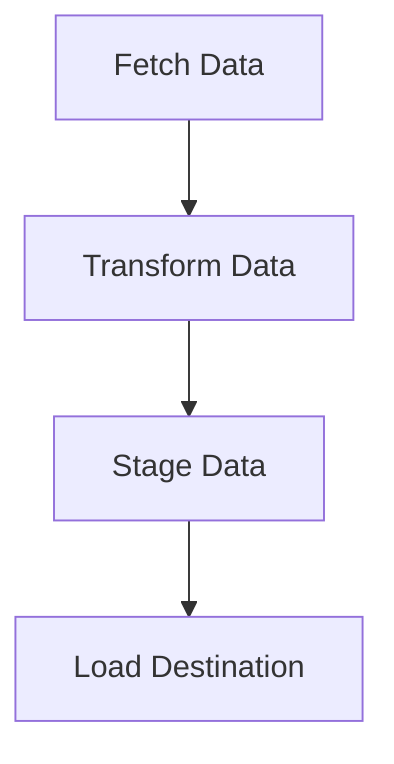

In the context of documentation generation, Mermaid integrates with validation to check syntax.

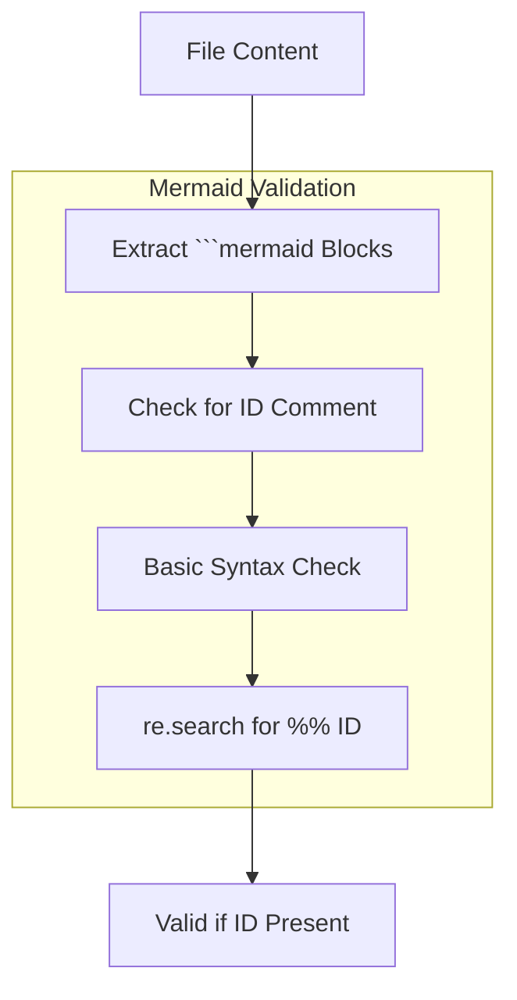

This flowchart depicts the Mermaid syntax validation process from `validate_docs.py`, ensuring diagrams include required comments.

## LLM-Friendly Writing Guidelines

Guidelines promote clarity for LLMs:
- Descriptive section headers
- Short, declarative sentences
- Explicit keywords (functions, file names, modules)
- Code snippets for logic descriptions
- Avoid undefined slang or abbreviations

Agents reference these rules via `AGENTS.md`, combining doc context with code comments and using Mermaid for flows.

```mermaid
flowchart TD
    A["LLM Agent"] --> B["Consult Documentation"]
    B --> C["Rule 1: Reference Docs"]
    B --> D["Rule 2: Doc + Code Comments"]
    B --> E["Rule 3: Mermaid for Flows"]
    B --> F["Rule 4: Follow Standards"]
    subgraph context["Documentation System"]
        G["/docs/ Primary Location"]
        H["docs-central Central Source"]
        I["Confluence Publishing Target"]
    end
    C --> G
    D --> G
    E --> G
    F --> G
```

This diagram shows agent rule application, derived from `AGENTS_TEMPLATE.md`.

## Versioning and Metadata

Each document ends with YAML metadata:

```
---
Last Updated: YYYY-MM-DD
Maintainer: @github-handle
Doc Version: vX.Y.Z
```

Validation in `validate_docs.py` checks for this pattern using regex: `r'\n---\nLast Updated: \d{4}-\d{2}-\d{2}\nMaintainer: @\w+\nDoc Version: v\d+\.\d+\.\d+\n---?$'`.

```python
def check_metadata(file_path):
    """Check if file has required metadata at the end."""
    try:
        with open(file_path, 'r', encoding='utf-8') as f:
            content = f.read()
        
        # Check for metadata section
        metadata_pattern = r'\n---\nLast Updated: \d{4}-\d{2}-\d{2}\nMaintainer: @\w+\nDoc Version: v\d+\.\d+\.\d+\n---?$'
        return bool(re.search(metadata_pattern, content))
    except Exception as e:
        print(f"Error reading {file_path}: {e}")
        return False
```

This function ensures metadata compliance during validation.

## Review and Approval

Workflow: LLM generates/updates via Cursor pre-commit; developer reviews/approves; merge to `main` triggers Confluence publishing.

From `DOCS_GENERATION_GUIDE.md`, pre-commit hook example:

```bash
#!/usr/bin/env bash
set -e
CHANGED=$(git diff --cached --name-only | grep -E '\.(py|js|sh) || true')
[ -z "$CHANGED" ] && exit 0

cursor-agent --headless --rules AGENTS.md --input "$CHANGED" --out docs/_suggested.patch
git apply docs/_suggested.patch || true
git add docs
```

CI performs staleness checks on PRs.

```mermaid
flowchart TD
    A["Developer Modifies Code"] --> B["Pre-commit Hook Triggered"]
    B --> C["Cursor Agent (LLM)"]
    C --> D["Propose Doc Updates (_suggested.patch)"]
    D --> E["Developer Reviews/Commits"]
    E --> F["Push to Git"]
    F --> G["CI Pipeline"]
    G --> H["Staleness Check"]
    G --> I["Doc Validation (validate_docs.py)"]
    I --> J["On Merge to main: Confluence Publish"]
    J --> K["Confluence Docs (Locked)"]
    H -.-> E
```

This sequence represents the review workflow, ensuring human oversight before publishing.

## Porting Legacy Docs

Migration unifies existing docs into the central repo.

Phases:
1. Inventory: Gather/classify docs (ACTIVE, STATIC, DEPRECATED)
2. Conversion: Use tools like Pandoc for Confluence/Google Docs
3. Standardization: Apply rules, add Mermaid, metadata
4. Validation: Run `make validate-docs`
5. Integration: Add as submodule, update `registry.yml`
6. Review: Domain owner approval

Conversion table from `DOCS_PORTING_GUIDE.md`:

| Source | Conversion Tool | Notes |
|--------|-----------------|-------|
| Confluence | Atlassian REST API → Markdown via `confluence-exporter` or Pandoc | Preserve headings, remove inline CSS |
| Google Docs | Drive export API → `.docx` → Pandoc → `.md` | Keep tables and bullets |
| Legacy MD | Manual copy + linting | Apply new style |

Validation uses `validate_docs.py` for linting, links, naming, and metadata.

```mermaid
flowchart TD
    A["Inventory Phase"] --> B["Gather Sources"]
    B --> C["Classify: ACTIVE/STATIC/DEPRECATED"]
    C --> D["Conversion Phase"]
    D --> E["Confluence: API/Pandoc"]
    D --> F["Google Docs: Export/Pandoc"]
    D --> G["Legacy MD: Copy/Lint"]
    E --> H["Standardization"]
    F --> H
    G --> H
    H --> I["Add Template Sections"]
    I --> J["Insert Mermaid"]
    J --> K["Add Metadata"]
    K --> L["Validation: make validate-docs"]
    L --> M["Linting/Mermaid/Links"]
    M --> N["Integration: Submodule Add"]
    N --> O["Update registry.yml"]
    O --> P["Review/Approval"]
```

This flowchart outlines the porting process, ensuring legacy content aligns with standards.

---
Last Updated: 2025-11-04  
Maintainer: @docs-team  
Doc Version: v1.0.0

---

<a id='page-6'></a>

## Deployment and Infrastructure

### Related Pages

Related topics: [Data Management and Flow](#page-4), [Extensibility and Customization](#page-7)

<details>
  <summary>Relevant source files</summary>

  The following files were used as context for generating this wiki page:

  - [README.md]
  - [DOCS_GENERATION_GUIDE.md]
  - [DOCS_PORTING_GUIDE.md]
  - [registry.yml]
  - [scripts/validate_docs.py]
  - [DOCS_STANDARDS.md]
  - [AGENTS_TEMPLATE.md]
</details>

# Deployment and Infrastructure

The Deployment and Infrastructure of the docs-central repository provide a centralized system for managing company documentation using Markdown and Mermaid diagrams. This setup ensures version-controlled, LLM-assisted documentation that is automatically published to Confluence for secure access by stakeholders. The infrastructure relies on GitHub for storage and submodules for project independence, with CI/CD pipelines handling validation, staleness checks, and publishing. Key elements include pre-commit hooks for generation, validation scripts, and secure Confluence integration, enabling a unified workflow from code changes to live documentation.

This infrastructure supports modular project documentation under `/projects/`, with automation via Cursor agents and scripts like `publish_confluence.sh` and `validate_docs.py`. It enforces standards for consistency and security, treating GitHub as the source of truth while Confluence serves as the read-only publishing target.

## Repository Structure and Submodules

The repository layout organizes documentation hierarchically, with core files at the root and project-specific content in submodules for independence.

Core directories include:
- Root files: `DOCS_STANDARDS.md`, `DOCS_GENERATION_GUIDE.md`, `DOCS_PORTING_GUIDE.md`, `AGENTS_TEMPLATE.md`.
- `/projects/`: Houses submodules like `migration/` containing `overview.md`, `fetcher/`, `transformer/`, and `loader/`.
- `/scripts/`: Contains utilities such as `publish_confluence.sh` for Confluence integration and `validate_docs.py` for linting and checks.

Submodules allow per-project documentation to be maintained separately while linking to the central repo. Adding a new project involves creating `/docs/` in the project repo, adding `AGENTS.md`, and registering via `./scripts/register-docs.sh <repo-url> <path>`, followed by committing to `docs-central`.

Configuration is managed in `registry.yml`, which lists projects with URLs, paths, status, and Confluence mappings.

```yaml
# From registry.yml
projects:
  migration:
    url: https://github.com/company/migration.git
    path: migration
    registered: 2025-11-04T00:00:00Z
    status: active
    description: Data migration system with fetcher, transformer, and loader components
    domain: data-engineering
    contact: @migration-team

domains:
  data-engineering:
    description: Data processing, migration, and infrastructure projects
    owner: @data-eng-lead
    confluence_space: DE

confluence:
  base_url: ${ATLASSIAN_BASE_URL}
  space_mappings:
    data-engineering: DE
    sales: SALES
    default: DOC
```

This structure ensures scalability, with `publishing` rules in `registry.yml` controlling auto-publish, stale checks (30 days), and exclusions like drafts.

```mermaid
flowchart TD
    subgraph core["Core Repository"]
        standards["DOCS_STANDARDS.md"]
        guides["DOCS_GENERATION_GUIDE.md<br/>DOCS_PORTING_GUIDE.md"]
        agents["AGENTS_TEMPLATE.md"]
        registry["registry.yml"]
        scripts["/scripts/<br/>publish_confluence.sh<br/>validate_docs.py"]
    end

    subgraph projects["/projects/ Directory"]
        migration["migration/<br/>(Submodule)"]
        sales["sales/<br/>(Submodule)"]
        overview["overview.md"]
        fetcher["fetcher/"]
    end

    registry --> migration
    registry --> sales
    guides --> scripts
    standards --> agents
    projects -.-> core
    scripts --> projects
```

The diagram illustrates the central core linking to modular projects via submodules, with scripts and registry enabling management.

## Documentation Generation and Automation

Documentation generation is automated through Cursor agents and pre-commit hooks, triggered by code modifications. The process detects changes in files like `.py`, `.sh`, or `.js`, then uses LLM context to propose updates in `/docs/_suggested.patch`.

The entry command for Cursor is:

```
# Add Documentation

Add comprehensive documentation for the current code/feature and format it according to the project's documentation standards.
```

The workflow follows `DOCS_STANDARDS.md` for structure, including sections like Overview, Architecture, and metadata (Last Updated, Maintainer, Doc Version).

A sample pre-commit hook script integrates this:

```bash
#!/usr/bin/env bash
set -e
CHANGED=$(git diff --cached --name-only | grep -E '\.(py|js|sh) || true')
[ -z "$CHANGED" ] && exit 0

cursor-agent --headless --rules AGENTS.md --input "$CHANGED" --out docs/_suggested.patch
git apply docs/_suggested.patch || true
git add docs
```

Agent rules from `AGENTS_TEMPLATE.md` emphasize referencing docs, using Mermaid for flows, and following standards. Commands include `# Add Documentation`, `# Update Documentation`, and `# Validate Docs`.

For legacy porting, `DOCS_PORTING_GUIDE.md` outlines conversion using tools like Pandoc, standardization, and validation via `make validate-docs`.

```mermaid
flowchart TD
    A["Developer Modifies<br/>Code (.py, .sh, etc.)"] --> B["Pre-commit Hook<br/>Triggered"]
    B --> C["Cursor Agent<br/>(LLM via AGENTS.md)"]
    C --> D["Generate/Update<br/>.md Files"]
    D --> E["Write to<br/>docs/_suggested.patch"]
    E --> F["Developer Reviews<br/>and Commits"]
    F --> G["Add Metadata<br/>(Last Updated, etc.)"]
    G --> H["Follow DOCS_STANDARDS.md<br/>(Structure, Mermaid)"]
```

This flowchart depicts the automated generation flow, ensuring docs align with code changes.

## Validation and Quality Assurance

Validation ensures compliance with standards, including metadata, Mermaid syntax, links, naming, and linting. The `validate_docs.py` script performs these checks recursively on `.md` files.

Key functions in `validate_docs.py`:

- `check_metadata(file_path)`: Verifies YAML-like metadata at file end using regex for Last Updated, Maintainer, and Doc Version.
- `check_mermaid_syntax(file_path)`: Extracts fenced Mermaid blocks, checks for ID comments (e.g., `%% data-pipeline-overview`).
- `check_markdown_links(file_path)`: Scans internal links, verifies file existence.
- `check_file_naming(file_path)`: Enforces lowercase-hyphen naming (e.g., `data-flow.md`).
- `lint_markdown(file_path)`: Runs `markdownlint` if available.
- `validate_directory(directory)`: Walks directory, validates all `.md` files.

Usage: `python scripts/validate_docs.py <path> --fix` (fix option attempts auto-corrections).

In PRs, CI runs staleness checks, commenting on outdated docs like `docs/FLOW.md`. Porting phase runs `make validate-docs` for linting, Mermaid syntax, links, and metadata.

```mermaid
sequenceDiagram
    participant dev as Developer
    participant ci as CI Pipeline
    participant script as validate_docs.py
    participant confluence as Confluence

    dev->>ci: Push PR with Code/Docs
    ci->>script: Run Validation<br/>(Metadata, Mermaid, Links)
    alt Stale Docs Detected
        script-->>ci: Comment "Potentially stale<br/>in docs/FLOW.md"
    else All Pass
        ci->>confluence: Prepare Publish (on merge)
    end
    Note over ci,script: Excludes drafts/temp files per registry.yml
```

The sequence shows validation integration in CI, with conditional staleness handling.

## Publishing Pipeline to Confluence

Publishing triggers on merges to `main`, using GitHub Actions like `markdown-confluence/publish-action`. It publishes under locked parent pages (bot-only edits), preserving Mermaid if the app is installed, or rendering to SVG via `mermaid-cli`.

Secrets required (from `DOCS_GENERATION_GUIDE.md`):
- `ATLASSIAN_BASE_URL`
- `ATLASSIAN_USER_EMAIL`
- `ATLASSIAN_API_TOKEN`
- `CONFLUENCE_SPACE_KEY`
- `CONFLUENCE_PARENT_PAGE_ID`

`registry.yml` maps domains to spaces (e.g., `data-engineering: DE`). Workflow: Developer commits → CI validates → Merge publishes to Confluence. Edits only via CI, with GitHub as source of truth.

For porting, integration adds submodules (`git submodule add <repo-url> projects/<domain>/<repo-name>`), updates `registry.yml`, pushes, and triggers CI.

```mermaid
flowchart TD
    A["Merge to main"] --> B["CI Pipeline<br/>Triggered"]
    B --> C["Staleness Check<br/>(30 days per registry.yml)"]
    C --> D["Run validate_docs.py<br/>(Lint, Metadata, etc.)"]
    D --> E["GitHub Action:<br/>markdown-confluence/publish-action"]
    E --> F["Publish to Confluence<br/>(Locked Pages)"]
    F --> G["Domain-Specific Spaces<br/>(e.g., DE for data-engineering)"]
    subgraph secrets["Required Secrets"]
        url["ATLASSIAN_BASE_URL"]
        email["ATLASSIAN_USER_EMAIL"]
        token["ATLASSIAN_API_TOKEN"]
        space["CONFLUENCE_SPACE_KEY"]
        parent["CONFLUENCE_PARENT_PAGE_ID"]
    end
    E --> secrets
    G --> H["Secure Access<br/>for Stakeholders"]
    C -.-> D : If no issues
```

This flowchart outlines the end-to-end publishing from merge to Confluence deployment.

## Security and Maintenance

Security ensures only CI bots edit Confluence, with all changes reviewed and versioned in Git. `registry.yml` excludes patterns like `*/drafts/*` and requires 1 reviewer. Maintenance involves quarterly credential updates (implied in workflows) and daily log monitoring for related projects.

Agent rules in `AGENTS_TEMPLATE.md` promote secure practices, like referencing docs before assumptions. Porting requires human review before publishing, assigning to domain owners.

No direct code for security, but validation script handles errors gracefully (e.g., file reading exceptions).

## Key Components Summary

- **Scripts**: `validate_docs.py` for checks; `publish_confluence.sh` for integration.
- **Configurations**: `registry.yml` for projects, domains, and publishing rules.
- **Automation**: Cursor agents via pre-commit; CI for validation and publish.
- **Standards Enforcement**: Metadata, naming, Mermaid IDs as per `DOCS_STANDARDS.md`.

This infrastructure maintains consistent, secure deployment of documentation across projects.

---

<a id='page-7'></a>

## Extensibility and Customization

### Related Pages

Related topics: [Documentation Standards](#page-5), [Deployment and Infrastructure](#page-6)

<details>
  <summary>Relevant source files</summary>

  The following files were used as context for generating this wiki page:

  - [DOCS_STANDARDS.md]
  - [README.md]
  - [DOCS_GENERATION_GUIDE.md]
  - [DOCS_PORTING_GUIDE.md]
  - [AGENTS_TEMPLATE.md]
  - [projects/migration/overview.md]
  - [projects/migration/FETCHER_OVERVIEW.md]
  - [scripts/validate_docs.py]
  - [registry.yml]
</details>

# Extensibility and Customization

The Extensibility and Customization features in the docs-central repository enable seamless integration of new projects, adaptation of documentation workflows, and tailored automation through LLM agents and configuration files. This system supports adding independent project submodules, migrating legacy documentation, and customizing agent behaviors via templates and rules, ensuring consistent yet flexible documentation management across the company. By leveraging Git submodules, CI pipelines, and Confluence publishing, it allows developers to extend the central repository without disrupting existing structures, while customization options like agent commands and registry entries provide project-specific adaptations.

High-level extensibility is achieved through modular project registration and automation hooks, with customization focused on standards compliance, validation, and publishing configurations derived from the core files.

## Project Extension Mechanisms

The system extends by incorporating new projects as submodules under `/projects/`, allowing independent repositories to integrate into the central documentation framework. This is outlined in the repository layout and adding new project workflows.

Key components include:
- Submodule addition for domains like `migration` and `sales`.
- Registration via scripts to update `registry.yml`.
- Automatic inclusion in CI publishing to Confluence.

Configuration elements in `registry.yml` define project URLs, paths, statuses, and domain mappings, enabling extensible scaling.

```yaml
# From registry.yml
projects:
  migration:
    url: https://github.com/company/migration.git
    path: migration
    registered: 2025-11-04T00:00:00Z
    status: active
    description: Data migration system with fetcher, transformer, and loader components
    domain: data-engineering
    contact: @migration-team
```

For adding a new project, the process involves creating `/docs/` in the project repo, adding `AGENTS.md`, and running registration.

```bash
# From README.md
./scripts/register-docs.sh <repo-url> <path>
```

This extensibility supports domains like `data-engineering` and `sales`, with confluence space mappings for customized publishing.

```mermaid
flowchart TD
    A["New Project Repo"] --> B["Create /docs/ and AGENTS.md"]
    B --> C["Run register-docs.sh"]
    C --> D["Update registry.yml"]
    D --> E["Add as Submodule in /projects/<domain>"]
    E --> F["Commit to docs-central"]
    F --> G["CI Triggers Publishing to Confluence"]
    H["Domain Config in registry.yml"] --> E
    subgraph domains["Domain Customization"]
        I["data-engineering: DE Space"]
        J["sales: SALES Space"]
    end
    H --> I
    H --> J
    E --> domains
```

The diagram illustrates the extension flow, where domain-specific customizations in `registry.yml` route publishing to appropriate Confluence spaces.

## Customization via Agent Rules and Templates

Customization occurs through `AGENTS_TEMPLATE.md`, which defines LLM agent behaviors for documentation generation and updates. Agents follow rules to reference docs, combine contexts, use Mermaid, and adhere to standards, allowing project-specific tailoring.

Key rules:
- Rule 1: Reference documentation before assumptions.
- Rule 2: Combine doc context + code comments.
- Rule 3: Use Mermaid diagrams for flows.
- Rule 4: Follow `DOCS_STANDARDS.md` for updates.

Agent commands include `# Add Documentation`, `# Update Documentation`, and `# Validate Docs`, invoked via pre-commit hooks.

From `AGENTS_TEMPLATE.md`:

```markdown
# Add Documentation

Create or expand docs for modified code following the template in `DOCS_GENERATION_GUIDE.md`.
```

This enables customization by injecting context, such as referencing specific files like `docs/FLOW.md`.

```mermaid
flowchart TD
    A["Developer Modifies Code"] --> B["Pre-commit Hook Triggers"]
    B --> C["Cursor Agent (LLM)"]
    C -- Consults --> D["AGENTS.md Rules"]
    D --> E["Rule 1: Reference Docs"]
    D --> F["Rule 2: Combine Context"]
    D --> G["Rule 3: Generate Mermaid"]
    D --> H["Rule 4: Follow Standards"]
    C --> I["Propose Doc Updates (.patch)"]
    I --> J["Developer Reviews/Commits"]
    subgraph customization["Agent Customization Points"]
        K["Project-Specific AGENTS.md"]
        L["Context Injection Examples"]
    end
    D --> K
    E --> L
```

The flowchart shows how agent rules customize documentation generation, with project-specific `AGENTS.md` files allowing tailored behaviors.

## Documentation Standards and Validation Customization

`DOCS_STANDARDS.md` provides a unified yet customizable structure for all docs, with templates for sections like Overview, Architecture, and Usage Examples. Customization includes file naming (lowercase-hyphens), Mermaid standards, and metadata requirements.

Validation is handled by `scripts/validate_docs.py`, which checks metadata, Mermaid syntax, links, naming, and linting, allowing `--fix` for auto-corrections.

Key functions in `validate_docs.py`:

```python
def check_metadata(file_path):
    """Check if file has required metadata at the end."""
    # Pattern matching for Last Updated, Maintainer, Doc Version

def check_mermaid_syntax(file_path):
    """Validate Mermaid diagram syntax."""
    # Checks for ID comments in blocks

def validate_file(file_path):
    """Validate a single markdown file."""
    # Aggregates checks and reports issues
```

Running validation:

```bash
python scripts/validate_docs.py --fix
```

This script customizes enforcement by optionally fixing issues, ensuring extensible compliance across projects.

```mermaid
flowchart TD
    A["Markdown File"] --> B["check_metadata()"]
    B --> C["Valid? (Pattern: --- Last Updated... )"]
    A --> D["check_mermaid_syntax()"]
    D --> E["ID Comment Present? (%% id)"]
    A --> F["check_markdown_links()"]
    F --> G["Internal Links Exist?"]
    A --> H["check_file_naming()"]
    H --> I["lowercase-hyphens.md?"]
    A --> J["lint_markdown()"]
    J --> K["markdownlint Return Code == 0"]
    subgraph validation["Customization via Flags"]
        L["--fix: Auto-correct"]
    end
    C --> M["Issues List"]
    E --> M
    G --> M
    I --> M
    K --> M
    M --> L
    L --> N["Apply Fixes if Clean"]
```

The diagram depicts the validation flow, highlighting customization through the `--fix` flag for automated adjustments.

## Legacy Porting and Integration Customization

`DOCS_PORTING_GUIDE.md` customizes migration of legacy docs from Confluence, Google Docs, or existing Markdown into the system, using tools like Pandoc and `confluence-exporter`. Phases include inventory, conversion, standardization, validation, and integration as submodules.

Conversion table from the guide:

| Source | Conversion Tool | Notes |
|--------|-----------------|-------|
| Confluence | Atlassian REST API → Markdown via `confluence-exporter` or Pandoc | Preserve headings, remove inline CSS |
| Google Docs | Drive export API → `.docx` → Pandoc → `.md` | Keep tables and bullets |
| Legacy MD | Manual copy + linting | Apply new style |

Post-conversion, apply standards, add Mermaid, and validate with `make validate-docs`. Integration updates `registry.yml` and adds submodules.

Example for migration project integration, as seen in `projects/migration/overview.md`, which follows the template with architecture diagrams and usage.

```mermaid
flowchart TD
    A["Inventory Legacy Docs"] --> B["Classify: ACTIVE/STATIC/DEPRECATED"]
    B --> C["Convert with Tools (Pandoc, API)"]
    C --> D["Standardize: Apply DOCS_STANDARDS.md"]
    D --> E["Add Mermaid Diagrams"]
    E --> F["Validate: make validate-docs"]
    F --> G["Integrate: git submodule add"]
    G --> H["Update registry.yml"]
    H --> I["Push & CI Publish to Confluence"]
    subgraph customization["Porting Options"]
        J["Replace Screenshots with Mermaid"]
        K["Add Metadata & Dates"]
    end
    D --> J
    E --> K
```

This flowchart outlines the porting process, with customizations like diagram replacements enhancing extensibility for legacy content.

## Publishing and Workflow Customization

`DOCS_GENERATION_GUIDE.md` and `README.md` detail customizable workflows: pre-commit hooks trigger Cursor agents, PRs run staleness checks, and merges publish to Confluence via GitHub Actions.

Pre-commit hook example:

```bash
#!/usr/bin/env bash
# From DOCS_GENERATION_GUIDE.md
CHANGED=$(git diff --cached --name-only | grep -E '\.(py|js|sh) || true')
cursor-agent --headless --rules AGENTS.md --input "$CHANGED" --out docs/_suggested.patch
git apply docs/_suggested.patch || true
git add docs
```

Publishing uses secrets like `ATLASSIAN_API_TOKEN` and `CONFLUENCE_SPACE_KEY`, with `publishing` rules in `registry.yml` for auto-publish, stale checks (30 days), and exclusions.

Staleness check in CI comments on PRs if docs lag code changes.

```mermaid
sequenceDiagram
    participant Dev as Developer
    participant Git as GitHub
    participant Cursor as Cursor Agent
    participant CI as CI Pipeline
    participant Conf as Confluence

    Dev->>Git: Modify Code & Commit
    Git->>Cursor: Pre-commit Hook
    Cursor->>Cursor: Generate Doc Patch (via AGENTS.md)
    Dev->>Git: Review & Push PR
    Git->>CI: Run Staleness Check
    Note over CI: Detects code changes without doc updates
    CI->>Git: Comment if Stale
    Dev->>Git: Merge to main
    Git->>CI: Trigger Publishing Action
    CI->>Conf: Publish Markdown (Locked Pages)
    Conf->>Dev: Secure Access with Version History

    alt Mermaid Handling
        CI->>Conf: Preserve Fenced Blocks if App Installed
        else
        CI->>Conf: Pre-render to SVG via mermaid-cli
    end
```

The sequence diagram captures the workflow, with customizations in staleness thresholds and Mermaid handling based on Confluence setup.

---

