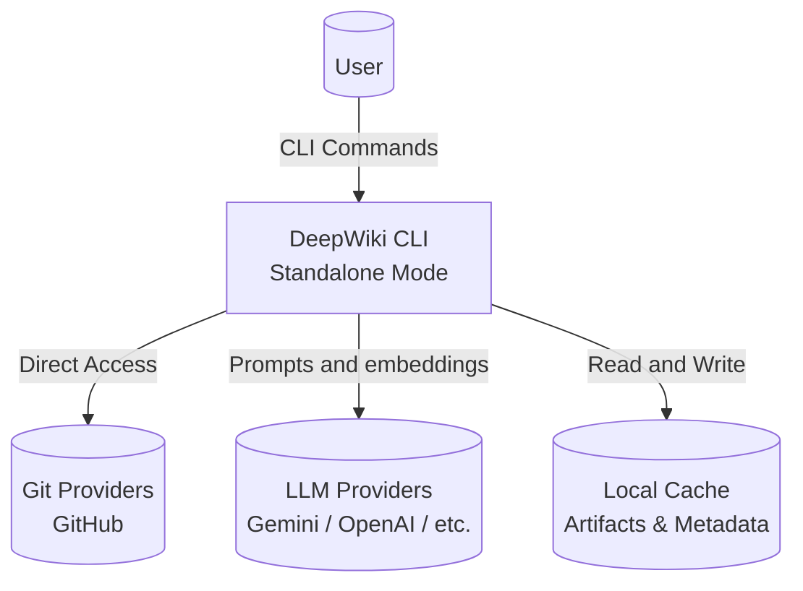
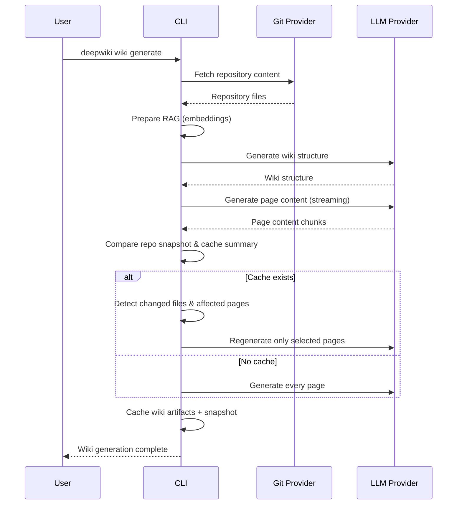

# OpenCorporates DeepWiki Architecture

This document gives a quick overview of the technologies in use and how the main pieces of OpenCorporates DeepWiki interact.

## Tech Stack

| Layer | Technology | Notes |
| ----- | ---------- | ----- |
| CLI | Python Click | Command-line interface for wiki generation |
| Background Processing | Custom RAG pipeline | Embedding + generation orchestrated in `src/deepwiki_cli/services/rag.py` |
| AI Providers | Google Gemini, OpenAI, OpenRouter, AWS Bedrock, Ollama | Configurable via `src/deepwiki_cli/config` and environment variables |
| Persistence | Local cache (filesystem) | Stores generated wiki artifacts and repo snapshots for reuse/versioning |
| Authentication | GitHub Token (via .env) | Simple token-based authentication for private repositories |
| Tooling | Poetry + Makefile | Simplifies local development and testing |

## High-Level Component View

## Wiki Generation Flow

## Architecture Mode

DeepWiki now operates solely as a CLI-first application. All repository scanning, wiki generation, caching, and editable workspace features run locally. The only outbound calls are to:

- Git hosting providers (GitHub REST API)
- LLM providers (Google, OpenAI, OpenRouter, Bedrock, or local Ollama)

There is no FastAPI or WebSocket server to deploy or configure.

## Component Details

### CLI (`src/deepwiki_cli/cli/`)

The CLI provides commands for wiki generation and management:

- `generate` - Generate wiki for a repository (with change detection, partial regeneration, and cache versioning)
- `export` - Export cached wiki to markdown/JSON
- `delete` - Delete cached wiki
- `list` - List all cached wikis
- `config` - Manage configuration

Key behaviors:

- **Repository snapshotting**: `generate` captures file metadata (path, size, hash, mtime) from GitHub trees or local checkout. Snapshots are stored alongside wiki payloads.
- **Change detection**: On subsequent runs the CLI diff snapshot A vs B to categorize changed/new/deleted files and compute the set of pages whose `filePaths` intersect with the diff.
- **Interactive regeneration**: Users can overwrite everything, update only affected pages (multi-select with optional per-page feedback), or fork a new cache version.
- **Version-aware management**: `list`, `export`, and `delete` commands operate on distinct cache versions, preserving historical snapshots for audits or comparisons.

### Core Logic (`src/deepwiki_cli/core/`)

Core business logic shared across commands:

- `completion.py` - Chat completion logic with streaming
- `github.py` - GitHub API integration

### RAG Pipeline (`src/deepwiki_cli/services/rag.py`)

The RAG (Retrieval-Augmented Generation) pipeline:

1. Fetches repository content
2. Generates embeddings for code files
3. Stores embeddings in vector store (FAISS)
4. Retrieves relevant context for prompts
5. Generates wiki content using LLM

### Model Clients

Support for multiple AI providers:

- `openai_client.py` - OpenAI API client
- `bedrock_client.py` - AWS Bedrock client
- `openrouter_client.py` - OpenRouter client
- `google_embedder_client.py` - Google embedding client
- `dashscope_client.py` - Alibaba Cloud DashScope client

## Data Flow

1. **Repository Fetching**: CLI or server fetches repository content from Git provider
2. **Snapshot Capture**: File metadata snapshot persists alongside the cache for future diffs
3. **Embedding Generation**: Code files are processed and embedded using configured embedder
4. **Vector Store**: Embeddings stored in FAISS for fast similarity search
5. **Wiki Structure Generation**: LLM generates wiki structure based on repository analysis
6. **Page Content Generation**: LLM generates individual page content with streaming
7. **Change Detection Loop**: Subsequent runs diff snapshots, select impacted pages, and optionally solicit user feedback before regenerating
8. **Caching**: Generated wiki artifacts plus the new snapshot are cached locally for reuse/versioning
9. **Export**: Cached wikis can be exported to markdown or JSON

## Configuration

Configuration is managed through:

- Environment variables (`.env` file)
- CLI configuration (`~/.deepwiki/config.json`)
- JSON config files (`src/deepwiki_cli/config/`)

See README.md for detailed configuration options.
