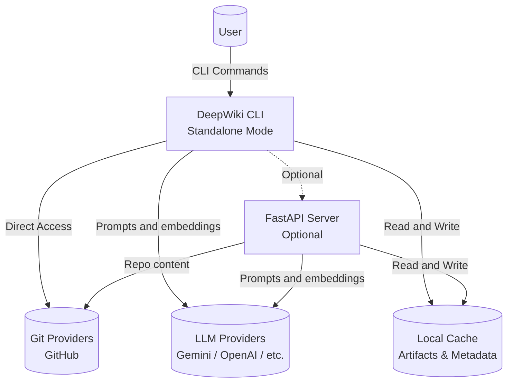
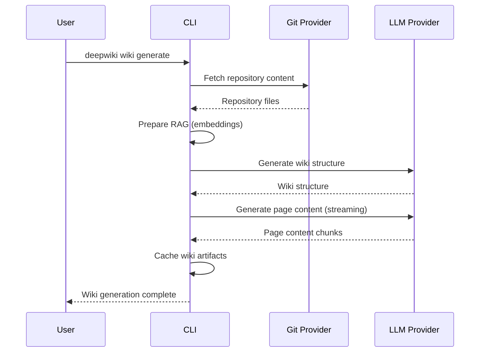

# OpenCorporates DeepWiki Architecture

This document gives a quick overview of the technologies in use and how the main pieces of OpenCorporates DeepWiki interact.

## Tech Stack

| Layer | Technology | Notes |
| ----- | ---------- | ----- |
| CLI | Python Click | Command-line interface for wiki generation |
| Backend | FastAPI (Python 3.11+) | Optional REST API server for shared resources |
| Background Processing | Custom RAG pipeline | Embedding + generation orchestrated in `api/rag.py` |
| AI Providers | Google Gemini, OpenAI, OpenRouter, Azure OpenAI, Ollama | Configurable via `api/config` and environment variables |
| Persistence | Local cache (filesystem) | Stores generated wiki artifacts for reuse |
| Authentication | GitHub Token (via .env) | Simple token-based authentication for private repositories |
| Tooling | Poetry for backend, Docker & Makefile | Simplifies local development and deployment |

## High-Level Component View



## Wiki Generation Flow



## Architecture Modes

### Standalone Mode (Default)

The CLI runs in standalone mode by default - no server required:

- Direct access to Git providers
- Direct access to LLM providers
- Local cache management
- No network dependencies (except Git and LLM APIs)

### Server Mode (Optional)

When configured, the CLI can connect to a FastAPI server:

- Shared embedding cache
- Centralized wiki generation service
- Multiple users accessing same repositories
- Faster subsequent runs (cached embeddings)

To enable server mode:
```bash
deepwiki config set use_server true
deepwiki config set server_url http://localhost:8001
```

## Component Details

### CLI (`api/cli/`)

The CLI provides commands for wiki generation and management:

- `generate` - Generate wiki for a repository
- `export` - Export cached wiki to markdown/JSON
- `delete` - Delete cached wiki
- `list` - List all cached wikis
- `config` - Manage configuration

### Core Logic (`api/core/`)

Core business logic shared between CLI and server:

- `chat.py` - Chat completion logic with streaming
- `github.py` - GitHub API integration
- `wiki_generator.py` - Wiki generation orchestration (if exists)

### RAG Pipeline (`api/rag.py`)

The RAG (Retrieval-Augmented Generation) pipeline:

1. Fetches repository content
2. Generates embeddings for code files
3. Stores embeddings in vector store (FAISS)
4. Retrieves relevant context for prompts
5. Generates wiki content using LLM

### Model Clients

Support for multiple AI providers:

- `openai_client.py` - OpenAI API client
- `bedrock_client.py` - AWS Bedrock client
- `openrouter_client.py` - OpenRouter client
- `azureai_client.py` - Azure OpenAI client
- `google_embedder_client.py` - Google embedding client
- `dashscope_client.py` - Alibaba Cloud DashScope client

### Optional Services

#### FastAPI Server (`api/server.py`)

Optional HTTP API server providing:

- Shared cache management
- GitHub/local repository structure fetching
- Export utilities (Markdown/JSON)

#### WebSocket Server (`api/websocket_wiki.py`)

Optional WebSocket server for:

- Real-time wiki generation updates
- Progress monitoring
- Team dashboard integration

## Data Flow

1. **Repository Fetching**: CLI or server fetches repository content from Git provider
2. **Embedding Generation**: Code files are processed and embedded using configured embedder
3. **Vector Store**: Embeddings stored in FAISS for fast similarity search
4. **Wiki Structure Generation**: LLM generates wiki structure based on repository analysis
5. **Page Content Generation**: LLM generates individual page content with streaming
6. **Caching**: Generated wiki artifacts cached locally for reuse
7. **Export**: Cached wikis can be exported to markdown or JSON

## Configuration

Configuration is managed through:

- Environment variables (`.env` file)
- CLI configuration (`~/.deepwiki/config.json`)
- JSON config files (`api/config/`)

See README.md for detailed configuration options.
