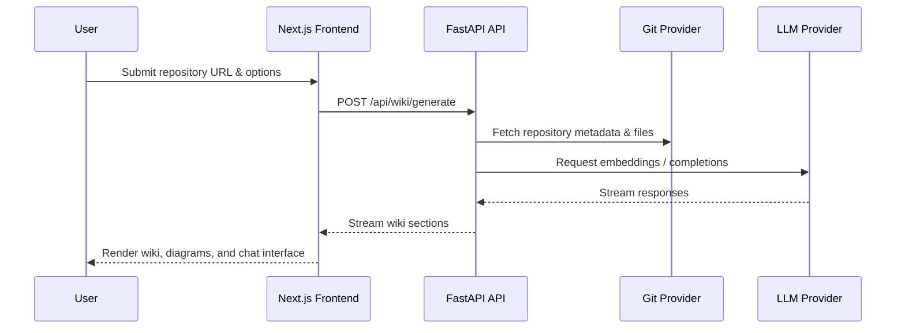

# OpenCorporates DeepWiki Architecture

This document gives a quick overview of the technologies in use and how the main pieces of OpenCorporates DeepWiki interact.

## Tech Stack

| Layer | Technology | Notes |
| ----- | ---------- | ----- |
| Frontend | Next.js 15 (App Router) + React 18 | Turbopack dev server, Tailwind CSS, next-themes for theming |
| State & Data Fetching | React hooks, custom contexts | Language selection, processed project cache |
| Visualization | Mermaid via dynamic component | Renders flow and sequence diagrams client-side |
| Backend | FastAPI (Python 3.12) | Provides REST & streaming endpoints for wiki generation |
| Background Processing | Custom RAG pipeline | Embedding + generation orchestrated in `api/rag.py` |
| AI Providers | Google Gemini, OpenAI, OpenRouter, Azure OpenAI, Ollama | Configurable via `api/config` and environment variables |
| Persistence | Local cache (filesystem) | Stores generated wiki artifacts for reuse |
| Tooling | Bun/Node for frontend, Poetry for backend, Docker & Makefile | Simplifies local development and deployment |

## High-Level Component View

```mermaid
graph TD
  User[(User Browser)]
  Frontend[Next.js Frontend<br/>App Router]
  Backend[FastAPI Backend<br/>Uvicorn]
  GitProviders[(Git Providers<br/>GitHub)]
  LLMs[(LLM Providers<br/>Gemini / OpenAI / etc.)]
  Cache[(Local Cache<br/>Artifacts & Metadata)]

  User -->|HTTP(S)| Frontend
  Frontend -->|fetch /api/...| Backend
  Backend -->|Repo content| GitProviders
  Backend -->|Prompts & embeddings| LLMs
  Backend -->|Read/Write| Cache
  Backend -->> Frontend: Streamed wiki content
  Frontend -->> User: Rendered wiki & diagrams
```

## Wiki Generation Flow



## Deployment & Local Development

- **Local Dev**: `make dev` (or `npm run dev` / `api/main.py`) runs Next.js with Turbopack on port 3000 and FastAPI on port 8001.
- **Environment**: `.env` controls API keys and backend configuration; frontend reads language config from `/api/lang/config`.
- **Containerization**: `docker-compose.yml` orchestrates the frontend and backend services; `Dockerfile` and `Dockerfile-ollama-local` target different runtime setups.

For deeper backend details, see `api/README.md`. Frontend components live under `src/app` and `src/components`.
