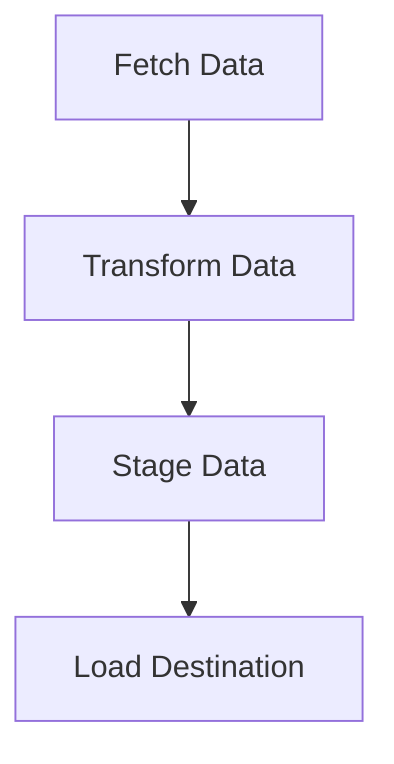
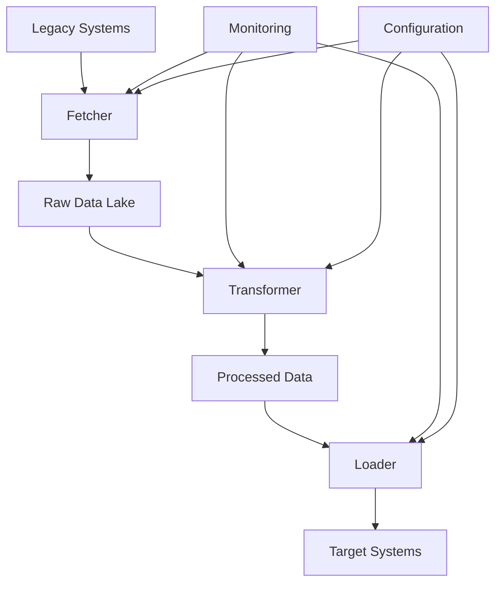
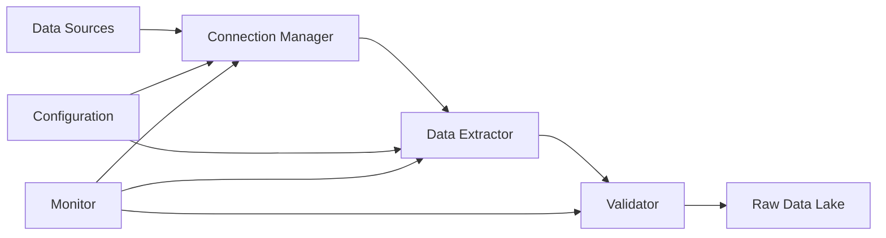
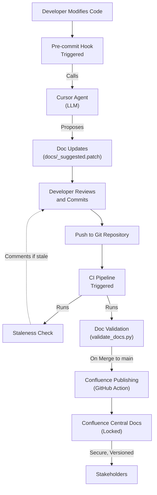
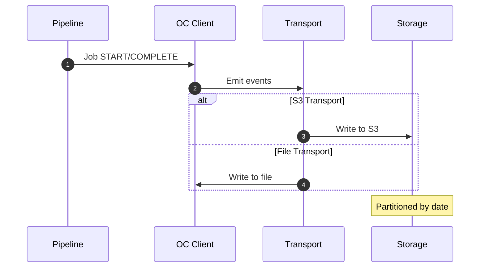
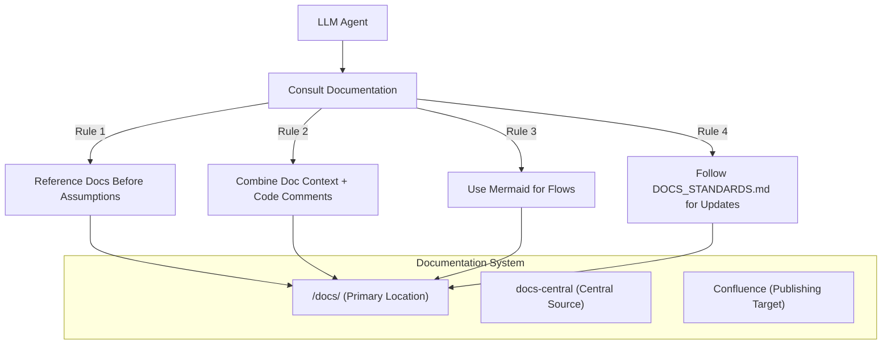
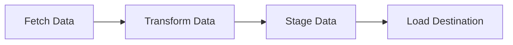

# Wiki Documentation for https://github.com/oc-andrey-zaharov/docs-central.git

Generated on: 2025-11-11 09:56:19

## Table of Contents

- [Overview and Key Features](#page-1)
- [Documentation Standards and Guidelines](#page-2)
- [Automated Documentation Workflow](#page-3)
- [Project Structure and Migration](#page-4)
- [Data Migration Project Details](#page-5)

<a id='page-1'></a>

## Overview and Key Features

### Related Pages

Related topics: [Documentation Standards and Guidelines](#page-2), [Automated Documentation Workflow](#page-3)

<details>
  <summary>Relevant source files</summary>

  The following files were used as context for generating this wiki page:

  - [DOCS_STANDARDS.md]
  - [README.md]
  - [DOCS_GENERATION_GUIDE.md]
  - [DOCS_PORTING_GUIDE.md]
  - [AGENTS_TEMPLATE.md]
  - [projects/migration/overview.md]
  - [projects/migration/FETCHER_OVERVIEW.md]
  - [scripts/validate_docs.py]
  - [registry.yml]
</details>

# Overview and Key Features

This document outlines the core principles and features of the Company Central Documentation System, a repository designed to centralize all company documentation. The system leverages Markdown with Mermaid diagrams, LLM automation via Cursor, and CI/CD pipelines for publishing to Confluence, ensuring a unified, version-controlled, and easily accessible documentation resource. The primary goal is to maintain consistency in structure and tone across all project documentation, making it understandable for LLMs, developers, and non-technical stakeholders.

The system's architecture supports modularity through submodules for individual projects and enforces strict documentation standards. This ensures that documentation remains a living asset, synchronized with code changes and accessible through a secure, versioned platform.

## Documentation Standards and Structure

The `DOCS_STANDARDS.md` file defines the unified structure, tone, and format for all documentation. Adherence to these standards is crucial for LLM comprehension and consistent maintenance.

### File Conventions

*   **Format:** UTF-8 Markdown (`.md`).
*   **Line Width:** Maximum 100 characters.
*   **Code Blocks:** Fenced code blocks (` ```python `) for code, fenced ` ```mermaid ` blocks for diagrams.
*   **File Naming:** Lowercase with hyphens (e.g., `data-flow.md`).
*   **Main Files:** Specific files like `OVERVIEW.md`, `FLOW.md`, `RUNBOOK.md`, `API.md`, and `AGENTS.md` are designated for core project documentation.

### Content Rules

Every document must address four key questions:
1.  **What** it does
2.  **Why** it exists
3.  **How** it works
4.  **Who** it affects

A standard structure template is provided:

```markdown
# Title
## Overview
## Architecture / Flow
## Key Components
## Usage Examples
## Dependencies
## Maintenance Notes
```

### Mermaid Standards

Mermaid diagrams are essential for visualizing processes and architectures.
*   A brief description must precede each diagram.
*   Each diagram must include an ID comment (e.g., `%% diagram-id`).



### LLM-Friendly Writing

*   Descriptive section headers.
*   Short, declarative sentences.
*   Inclusion of relevant keywords (functions, file names, modules).
*   Code snippets to illustrate logic.
*   Avoidance of undefined internal slang or abbreviations.

### Versioning and Metadata

Each document must conclude with metadata:

```
---
Last Updated: YYYY-MM-DD
Maintainer: @github-handle
Doc Version: vX.Y.Z
```

## Automated Documentation Generation

The `DOCS_GENERATION_GUIDE.md` outlines the process for LLM-assisted documentation generation, primarily using Cursor agents and pre-commit hooks.

### Cursor Agent Workflow

1.  **Detection:** Agents detect modified code files.
2.  **Generation:** LLMs generate or update corresponding `.md` files based on code changes and `DOCS_STANDARDS.md`.
3.  **Output:** Suggested changes are written to `/docs/_suggested.patch`, which can be automatically applied.

### Pre-Commit Hook

A pre-commit hook can be configured to automatically invoke Cursor agents:

```bash
#!/usr/bin/env bash
set -e
CHANGED=$(git diff --cached --name-only | grep -E '\.(py|js|sh) || true')
[ -z "$CHANGED" ] && exit 0

cursor-agent --headless --rules AGENTS.md --input "$CHANGED" --out docs/_suggested.patch
git apply docs/_suggested.patch || true
git add docs
```

### Pull Request Validation

A CI job checks for code changes lacking corresponding documentation updates, posting non-blocking messages.

### Confluence Publishing

Merges to the `main` branch trigger a GitHub Action (`markdown-confluence/publish-action`) to publish documentation to Confluence. Edits to Confluence are restricted to this CI bot, maintaining GitHub as the source of truth.

### Mermaid Handling

The `markdown-confluence/publish-action` handles Mermaid diagrams. If the Confluence Mermaid app is installed, fenced blocks are preserved. Otherwise, diagrams are pre-rendered to SVG using `mermaid-cli`.

## Legacy Documentation Migration

The `DOCS_PORTING_GUIDE.md` details the process for migrating existing documentation from various sources (Confluence, Google Docs, legacy Markdown) into the central repository.

### Migration Phases

1.  **Inventory:** Gather and classify all existing documentation.
2.  **Conversion:** Use tools like Pandoc or API exports to convert sources to Markdown.
3.  **Standardization:** Apply `DOCS_STANDARDS.md` rules, ensuring metadata and Mermaid diagrams are included.
4.  **Validation:** Use `make validate-docs` to check for linting errors, broken links, and metadata compliance.
5.  **Integration:** Add projects as submodules and trigger CI for Confluence publishing.

## Repository Structure and Layout

The `README.md` provides an overview of the repository structure:

```
docs-central/
│
├── DOCS_STANDARDS.md
├── DOCS_GENERATION_GUIDE.md
├── DOCS_PORTING_GUIDE.md
├── AGENTS_TEMPLATE.md
├── projects/
│   ├── migration/
│   │   ├── overview.md
│   │   ├── fetcher/ (submodule)
│   │   ├── transformer/ (submodule)
│   │   └── loader/ (submodule)
│   └── sales/ (submodule)
│
└── scripts/
├── publish_confluence.sh
└── validate_docs.py
```

## Project-Specific Documentation Examples

### Data Migration Project (`projects/migration/overview.md`)

This project centralizes data migration processes, consisting of Fetcher, Transformer, and Loader components.



### Fetcher Component (`projects/migration/FETCHER_OVERVIEW.md`)

The Fetcher component extracts data from legacy systems into a raw data lake, featuring a Connection Manager, Data Extractor, and Validator.



## Documentation Validation Script (`scripts/validate_docs.py`)

This script programmatically validates Markdown files against established documentation standards.

### Validation Checks

The script performs the following checks on each `.md` file:
*   **Metadata:** Verifies the presence and format of `Last Updated`, `Maintainer`, and `Doc Version` metadata.
*   **Mermaid Syntax:** Checks for valid Mermaid diagram syntax and the presence of ID comments.
*   **Markdown Links:** Detects broken internal links.
*   **File Naming:** Enforces the `lowercase-with-hyphens.md` convention.
*   **Markdown Linting:** Utilizes `markdownlint` for stylistic and structural checks.

### Usage

The script can validate a specific file or an entire directory recursively.

```python
# Example usage to validate a directory
python scripts/validate_docs.py ./projects/migration
```

## Agent Rules and Commands (`AGENTS_TEMPLATE.md`)

This template defines how LLM agents should interact with the documentation system.

### Core Principles

*   **Rule 1:** Always reference documentation before making assumptions.
*   **Rule 2:** Combine doc context with code comments for explanations.
*   **Rule 3:** Use Mermaid diagrams for describing flows.
*   **Rule 4:** Follow `DOCS_STANDARDS.md` when updating documentation.

### Agent Commands

*   `# Add Documentation`: Create or expand docs.
*   `# Update Documentation`: Regenerate affected sections.
*   `# Validate Docs`: Lint and verify compliance.

## Registry and Configuration (`registry.yml`)

The `registry.yml` file serves as a central registry for projects and their documentation locations, as well as for domain-specific configurations and publishing rules.

### Project Registry

Lists projects, their GitHub URLs, paths, registration details, status, and contacts.

```yaml
projects:
  migration:
    url: https://github.com/company/migration.git
    path: migration
    registered: 2025-11-04T00:00:00Z
    status: active
    description: Data migration system with fetcher, transformer, and loader components
    domain: data-engineering
    contact: @migration-team
```

### Domain Definitions

Defines domains with descriptions, owners, and Confluence space keys.

```yaml
domains:
  data-engineering:
    description: Data processing, migration, and infrastructure projects
    owner: @data-eng-lead
    confluence_space: DE
```

### Confluence Publishing Configuration

Specifies Confluence base URL and space mappings.

```yaml
confluence:
  base_url: ${ATLASSIAN_BASE_URL}
  space_mappings:
    data-engineering: DE
    sales: SALES
    default: DOC
```

### Publishing Rules

Configures auto-publishing, staleness checks, and review requirements.

```yaml
publishing:
  auto_publish: true
  stale_check_days: 30
  required_reviewers: 1
  exclude_patterns:
    - "*/drafts/*"
    - "*/temp/*"
    - "*.draft.md"

---

<a id='page-2'></a>

## Documentation Standards and Guidelines

### Related Pages

Related topics: [Automated Documentation Workflow](#page-3), [Project Structure and Migration](#page-4)

<details>
  <summary>Relevant source files</summary>

  The following files were used as context for generating this wiki page:

  - [DOCS_STANDARDS.md]
  - [README.md]
  - [DOCS_GENERATION_GUIDE.md]
  - [DOCS_PORTING_GUIDE.md]
  - [AGENTS_TEMPLATE.md]
  - [scripts/validate_docs.py]
  - [registry.yml]
</details>

# Documentation Standards and Guidelines

## Introduction

The `docs-central` repository serves as the single source of truth for all company documentation. Its primary purpose is to centralize, standardize, and automate the management of documentation across various projects. This ensures consistency in structure, tone, and format, making documentation easily understandable and maintainable by LLMs, developers, and non-technical stakeholders. The system leverages Markdown with Mermaid diagrams, LLM automation via Cursor, and CI/CD pipelines for publishing to Confluence, ensuring secure, versioned access.

## 1. File Conventions

All documentation files must adhere to specific naming and formatting conventions to maintain consistency and facilitate automated processing.

### 1.1. Format and Encoding

*   **Default Format:** UTF-8 Markdown (`.md`).
*   **Line Width:** Maximum of 100 characters per line.
*   **Code Blocks:** Use fenced code blocks for code snippets (e.g., ` ```python `).
*   **Diagrams:** Use fenced ` ```mermaid ` blocks for diagrams.

### 1.2. File Naming

*   **Convention:** All files must use lowercase with hyphens (e.g., `data-flow.md`).
*   **Main Files:** Specific files have designated names for core project information:
    *   `OVERVIEW.md`: Project purpose and scope.
    *   `FLOW.md`: Process flow and diagrams.
    *   `RUNBOOK.md`: Operational guidance.
    *   `API.md`: API or interface documentation.
    *   `AGENTS.md`: Cursor rules and quick access information for LLM agents.

## 2. Content Rules

Every document must comprehensively answer four fundamental questions to ensure clarity and completeness.

### 2.1. Core Questions

1.  **What** it does.
2.  **Why** it exists.
3.  **How** it works.
4.  **Who** it affects.

### 2.2. Structure Template

A standardized structure is recommended for all documentation pages:

```markdown
# Title
## Overview
## Architecture / Flow
## Key Components
## Usage Examples
## Dependencies
## Maintenance Notes
```

## 3. Mermaid Standards

Mermaid diagrams are crucial for visualizing complex information. Specific guidelines ensure their effectiveness and consistency.

### 3.1. Diagram Usage

*   **Description:** Always include a brief description above each diagram.
*   **ID Comment:** Each diagram must have an ID comment for reference (e.g., `%% data-pipeline-overview`).

### 3.2. Flowchart Syntax Requirements

*   **Directive:** Always use `flowchart TD`.
*   **Node Labels:** Must be enclosed in quotes. Use `<br/>` for line breaks within labels. Labels should be concise (3-4 words max per line).
*   **Arrows:** Use `-->` for simple flow, `-. ->` for dotted, `-->|label|` for labeled edges.
*   **Subgraphs:** Use `subgraph id["Name"] ... end` syntax.
*   **Node IDs:** Use simple alphanumeric IDs (e.g., `A`, `B`, `node1`). Avoid special characters.



### 3.3. Sequence Diagram Syntax Requirements

*   **Directive:** Start with `sequenceDiagram`.
*   **Participants:** Declare ALL participants at the beginning with concise names (e.g., `participant pipeline as Pipeline`).
*   **Messages:** Use correct arrow syntax (`->>` for solid, `-->>` for dotted). Message syntax: `A->>B: Message text`.
*   **Notes:** Use `Note over participant1,participant2: Note text` or `Note right of participant: Note text`.



## 4. LLM-Friendly Writing Guidelines

To ensure LLMs can effectively process and generate documentation, specific writing practices are encouraged.

*   **Headers:** Use descriptive section headers.
*   **Sentences:** Prefer short, declarative sentences.
*   **Keywords:** Explicitly include relevant keywords (functions, file names, modules).
*   **Code Snippets:** Include code snippets when describing logic, as LLMs rely on pattern cues.
*   **Terminology:** Avoid internal slang or abbreviations without definitions.



## 5. Versioning and Metadata

Each documentation file must include versioning and maintainer information at the end.

### 5.1. Metadata Format

```
---
Last Updated: YYYY-MM-DD
Maintainer: @github-handle
Doc Version: vX.Y.Z
```

## 6. Review and Approval Workflow

A defined workflow ensures documentation is accurate, up-to-date, and properly integrated.

### 6.1. Generation and Review

1.  **LLM Generation/Update:** Documentation is generated or updated by LLMs (e.g., via Cursor) using pre-commit hooks.
2.  **Developer Review:** Developers review proposed documentation changes.
3.  **Commit:** Approved changes are committed.

### 6.2. CI/CD Pipeline

*   **Trigger:** Merges to the `main` branch trigger the Confluence publishing CI.
*   **Publishing:** A GitHub Action (`markdown-confluence/publish-action`) publishes documentation to Confluence.
*   **Access Control:** Confluence pages are published under a locked parent page, meaning only the CI bot can edit them. The GitHub Markdown files remain the source of truth.

### 6.3. Staleness Check

A CI job runs on pull requests to detect code changes without corresponding doc updates. It posts a non-blocking message if potentially stale documentation is found.

## 7. Porting Legacy Docs

A systematic process is followed when migrating existing documentation to the new standard.

### 7.1. Migration Phases

1.  **Inventory:** Gather all documentation sources, classify by project, and tag as `ACTIVE`, `STATIC`, or `DEPRECATED`.
2.  **Conversion:** Convert content from sources like Confluence (using APIs and exporters) or Google Docs to Markdown. Legacy Markdown files are manually updated.
3.  **Standardization:** Apply `DOCS_STANDARDS.md` rules, ensure required sections and metadata are present, and replace screenshots with Mermaid diagrams where feasible.
4.  **Validation:** Run `make validate-docs` (or `python scripts/validate_docs.py`) to check for linting errors, Mermaid syntax issues, broken links, and metadata presence.
5.  **Integration:** Add projects as submodules to `docs-central`, update `registry.yml`, and push to trigger CI publishing.
6.  **Review & Approval:** Assign migrated documents to domain owners for human review before publishing.

### 7.2. Validation Script

The `scripts/validate_docs.py` script automates the validation process, checking for metadata, Mermaid syntax, broken links, file naming conventions, and general Markdown linting.

```python
#!/usr/bin/env python3
"""
Documentation validation script for docs-central.
Validates markdown files against the established standards.
"""

import os
import re
import sys
import argparse
from pathlib import Path
from datetime import datetime
import subprocess

def check_metadata(file_path):
    """Check if file has required metadata at the end."""
    try:
        with open(file_path, 'r', encoding='utf-8') as f:
            content = f.read()
        
        # Check for metadata section
        metadata_pattern = r'\n---\nLast Updated: \d{4}-\d{2}-\d{2}\nMaintainer: @\w+\nDoc Version: v\d+\.\d+\.\d+\n---?$'
        return bool(re.search(metadata_pattern, content))
    except Exception as e:
        print(f"Error reading {file_path}: {e}")
        return False

def check_mermaid_syntax(file_path):
    """Validate Mermaid diagram syntax."""
    try:
        with open(file_path, 'r', encoding='utf-8') as f:
            content = f.read()
        
        mermaid_blocks = re.findall(r'```mermaid\n(.*?)\n```', content, re.DOTALL)
        
        for block in mermaid_blocks:
            # Basic syntax checks
            if not block.strip():
                continue
                
            # Check for ID comment
            if not re.search(r'%%\s+\w+', block):
                print(f"Warning: Mermaid block in {file_path} missing ID comment")
        
        return True
  
    except Exception as e:
        print(f"Error checking Mermaid in {file_path}: {e}")
        return False

def check_markdown_links(file_path):
    """Check for broken internal links."""
    try:
        with open(file_path, 'r', encoding='utf-8') as f:
            content = f.read()
        
        # Find all markdown links
        links = re.findall(r'\[([^\]]+)\]\(([^)]+)\)', content)
        broken_links = []
        
        for text, link in links:
            if link.startswith('http'):
                continue  # Skip external links
            
            # Check if the linked file exists
            link_path = Path(file_path).parent / link
            if not link_path.exists():
                broken_links.append((text, link))
        
        if broken_links:
            print(f"Broken links in {file_path}:")
            for text, link in broken_links:
                print(f"  - [{text}]({link})")
        
        return len(broken_links) == 0
    except Exception as e:
        print(f"Error checking links in {file_path}: {e}")
        return False

def check_file_naming(file_path):
    """Check if file follows naming conventions."""
    file_name = os.path.basename(file_path)
    
    # Check for lowercase with hyphens
    if not re.match(r'^[a-z0-9-]+\.md$', file_name):
        print(f"Warning: {file_name} doesn't follow lowercase-with-hyphens convention")
        return False
    
    return True

def lint_markdown(file_path):
    """Run markdown linting if available."""
    try:
        # Try to run markdownlint
        result = subprocess.run(['markdownlint', file_path], 
                              capture_output=True, text=True)
        return result.returncode == 0
    except FileNotFoundError:
        print("Warning: markdownlint not found. Install it for better validation.")
        return True

def validate_file(file_path):
    """Validate a single markdown file."""
    print(f"Validating {file_path}...")
    
    issues = []
    
    if not check_metadata(file_path):
        issues.append("Missing or invalid metadata")
    
    if not check_mermaid_syntax(file_path):
        issues.append("Mermaid syntax issues")
    
    if not check_markdown_links(file_path):
        issues.append("Broken internal links")
    
    if not check_file_naming(file_path):
        issues.append("File naming convention issues")
    
    if not lint_markdown(file_path):
        issues.append("Markdown linting issues")
    
    if issues:
        print(f"  Issues found: {', '.join(issues)}")
        return False
    else:
        print("  ✓ All checks passed")
        return True

def validate_directory(directory):
    """Validate all markdown files in a directory recursively."""
    md_files = []
    for root, dirs, files in os.walk(directory):
        for file in files:
            if file.endswith('.md'):
                md_files.append(os.path.join(root, file))
    
    if not md_files:
        print("No markdown files found")
        return True
    
    print(f"Found {len(md_files)} markdown files")
    
    all_passed = True
    for file_path in md_files:
        if not validate_file(file_path):
            all_passed = False
    
    return all_passed

def main():
    parser = argparse.ArgumentParser(description='Validate documentation files')
    parser.add_argument('path', nargs='?', default='.', 
                       help='Path to validate (default: current directory)')
    parser.add_argument('--fix', action='store_true',
                       help='Attempt to auto-fix issues')
    
    args = parser.parse_args()
    
    path = Path(args.path).resolve()
    
    if path.is_file():
        success = validate_file(str(path))
    elif path.is_dir():
        success = validate_directory(str(path))
    else:
        print(f"Error: {path} is not a valid file or directory")
        sys.exit(1)
    
    if success:
        print("\n✓ All validations passed!")
        sys.exit(0)
    else:
        print("\n✗ Validation failed")
        sys.exit(1)

if __name__ == '__main__':
    main()
```

## 8. Repository Structure and Management

The `docs-central` repository employs a submodule architecture and a registry to manage documentation for multiple projects.

### 8.1. Repository Layout

```
docs-central/
│
├── DOCS_STANDARDS.md
├── DOCS_GENERATION_GUIDE.md
├── DOCS_PORTING_GUIDE.md
├── AGENTS_TEMPLATE.md
├── projects/
│   ├── migration/
│   │   ├── overview.md
│   │   ├── fetcher/ (submodule)
│   │   ├── transformer/ (submodule)
│   │   └── loader/ (submodule)
│   └── sales/ (submodule)
│
└── scripts/
├── publish_confluence.sh
└── validate_docs.py
```

### 8.2. Project Registration

New projects are integrated by adding their documentation directories as Git submodules and registering them in `registry.yml`.

#### `registry.yml` Example:

```yaml
# Documentation Registry
# Lists all registered projects and their documentation locations

projects:
  migration:
    url: https://github.com/company/migration.git
    path: migration
    registered: 2025-11-04T00:00:00Z
    status: active
    description: Data migration system with fetcher, transformer, and loader components
    domain: data-engineering
    contact: @migration-team
    
domains:
  data-engineering:
    description: Data processing, migration, and infrastructure projects
    owner: @data-eng-lead
    confluence_space: DE
    
# Confluence publishing configuration
confluence:
  base_url: ${ATLASSIAN_BASE_URL}
  space_mappings:
    data-engineering: DE
    sales: SALES
    default: DOC
    
# Publishing rules
publishing:
  auto_publish: true
  stale_check_days: 30
  required_reviewers: 1
  exclude_patterns:
    - "*/drafts/*"
    - "*/temp/*"
    - "*.draft.md"
```

### 8.3. Adding a New Project

1.  Create a `/docs/` directory within the project repository and add an `AGENTS.md` file.
2.  Register the project using the script: `./scripts/register-docs.sh <repo-url> <path>`.
3.  Commit and push the changes to `docs-central`.

## 9. Agent Integration

The `AGENTS.md` file defines how LLM agents should interact with project documentation, establishing rules and commands for AI-assisted development.

### 9.1. Agent Rules

*   **Rule 1:** Always reference documentation before making assumptions.
*   **Rule 2:** Combine doc context with code comments for explanations.
*   **Rule 3:** Use Mermaid diagrams for describing flows.
*   **Rule 4:** Follow `DOCS_STANDARDS.md` when updating documentation.

### 9.2. Agent Commands

*   `# Add Documentation`: Create or expand docs for modified code.
*   `# Update Documentation`: Regenerate affected sections after code changes.
*   `# Validate Docs`: Lint and verify compliance with standards.

```mermaid
classDiagram
    class Agent {
        +String name
        +String rules_file
        +executeCommand(command: String, context: String): String
    }

    class DocumentationSystem {
        +String primary_docs_location
        +String central_source
        +String publishing_target
        +getDoc(filePath: String): String
        +updateDoc(filePath: String, content: String): void
    }

    class CursorAgent {
        +Agent agent
        +DocumentationSystem docs_system
        +processChange(change: CodeChange): void
    }

    Agent <|-- CursorAgent
    CursorAgent --> DocumentationSystem : interacts with

---

<a id='page-3'></a>

## Automated Documentation Workflow

### Related Pages

Related topics: [Overview and Key Features](#page-1), [Documentation Standards and Guidelines](#page-2), [Project Structure and Migration](#page-4)

<details>
  <summary>Relevant source files</summary>

  The following files were used as context for generating this wiki page:

  - [DOCS_GENERATION_GUIDE.md]
  - [AGENTS_TEMPLATE.md]
  - [scripts/validate_docs.py]
  - [registry.yml]
  - [DOCS_STANDARDS.md]
</details>
# Automated Documentation Workflow

The Automated Documentation Workflow is a system designed to streamline the creation, validation, and publication of project documentation, leveraging LLM agents and CI/CD pipelines. Its primary goal is to ensure that all documentation is consistent, up-to-date, and accessible, thereby reducing manual effort and improving the overall quality of documentation across the organization. This workflow integrates with code changes, automatically proposing and applying documentation updates, and finally publishing them to a central, secure location like Confluence.

## Overview of the Workflow

The automated documentation process begins with code modifications and culminates in published documentation. This workflow relies on a combination of pre-commit hooks, LLM agents, CI pipelines, and a central registry to manage documentation for various projects.

### Workflow Stages

The automated documentation workflow can be broken down into several key stages:

1.  **Code Modification:** A developer makes changes to the project's codebase.
2.  **Doc Generation/Update:** A pre-commit hook triggers an LLM agent (like Cursor) to generate or update relevant documentation files based on the code changes.
3.  **Developer Review:** The developer reviews the proposed documentation changes and commits them.
4.  **CI Validation:** A Continuous Integration pipeline runs to validate the documentation for staleness and adherence to standards.
5.  **Publishing:** Upon merging to the main branch, a CI process publishes the validated documentation to a central repository (e.g., Confluence).

```mermaid
flowchart TD
    A[Developer Modifies Code] --> B[Pre-commit Hook Triggered]
    B -- Calls --> C["Cursor Agent<br/>(LLM)"]
    C -- Proposes --> D["Doc Updates<br/>(docs/_suggested.patch)"]
    D --> E[Developer Reviews<br/>and Commits]
    E --> F[Push to Git Repository]
    F --> G[CI Pipeline<br/>Triggered]
    G -- Runs --> H[Staleness Check]
    G -- Runs --> I["Doc Validation<br/>(scripts/validate_docs.py)"]
    I -- On Merge to main --> J["Confluence Publishing<br/>(GitHub Action)"]
    J --> K["Confluence Central Docs<br/>(Locked)"]
    K -- Secure, Versioned --> L[Stakeholders]
    H -. Comments if stale .-> E
```

## Components and Tools

The automated documentation workflow utilizes several key components and tools to achieve its objectives.

### LLM Agents and Cursor

LLM agents, such as those integrated via Cursor, play a crucial role in generating and updating documentation.

*   **Entry Command:** Agents are typically invoked with commands like `# Add Documentation` or `# Update Documentation`. The `# Add Documentation` command instructs the agent to create comprehensive documentation for the current code/feature, formatted according to project standards.
*   **Workflow:** When code files are modified, the agent detects these changes and generates or updates corresponding `.md` files. These suggested changes are written to a patch file (e.g., `/docs/_suggested.patch`) which can be automatically applied if clean.
*   **Rules:** Agents are guided by rules defined in `AGENTS_TEMPLATE.md`. These rules emphasize referencing documentation before making assumptions, combining doc context with code comments, using Mermaid diagrams for flows, and adhering to `DOCS_STANDARDS.md` when updating documents.


### Pre-Commit Hooks

Pre-commit hooks automate the process of invoking LLM agents before code is committed.

*   **Example Script:** A typical pre-commit hook script (as shown in `DOCS_GENERATION_GUIDE.md`) checks for modified Python, JavaScript, or shell script files. If changes are detected, it executes the `cursor-agent` command with specific rules and inputs, generating a patch file. The hook then applies this patch and stages the documentation changes.

```python
#!/usr/bin/env bash
set -e
CHANGED=$(git diff --cached --name-only | grep -E '\.(py|js|sh) || true')
[ -z "$CHANGED" ] && exit 0

cursor-agent --headless --rules AGENTS.md --input "$CHANGED" --out docs/_suggested.patch
git apply docs/_suggested.patch || true
git add docs
```

### CI Pipeline and Validation

The CI pipeline ensures the quality and consistency of documentation.

*   **Staleness Check:** A CI job on pull requests detects code changes that lack corresponding documentation updates. It posts a non-blocking message, alerting developers to potentially stale documentation. Developers can opt to skip this check if the code change is non-functional.
*   **Documentation Validation:** The `scripts/validate_docs.py` script is used to lint and verify markdown files. It checks for adherence to `DOCS_STANDARDS.md`, including metadata presence, Mermaid syntax, internal link integrity, and file naming conventions. The `make validate-docs` command is used to run this validation process.

```python
#!/usr/bin/env python3
"""
Documentation validation script for docs-central.
Validates markdown files against the established standards.
"""

import os
import re
import sys
import argparse
from pathlib import Path
from datetime import datetime
import subprocess

# ... (rest of the script content) ...

def validate_file(file_path):
    """Validate a single markdown file."""
    print(f"Validating {file_path}...")
    
    issues = []
    
    if not check_metadata(file_path):
        issues.append("Missing or invalid metadata")
    
    if not check_mermaid_syntax(file_path):
        issues.append("Mermaid syntax issues")
    
    if not check_markdown_links(file_path):
        issues.append("Broken internal links")
    
    if not check_file_naming(file_path):
        issues.append("File naming convention issues")
    
    if not lint_markdown(file_path):
        issues.append("Markdown linting issues")
    
    if issues:
        print(f"  Issues found: {', '.join(issues)}")
        return False
    else:
        print("  ✓ All checks passed")
        return True

# ... (rest of the script content) ...
```

### Confluence Publishing

The final stage involves publishing the validated documentation to Confluence.

*   **Trigger:** This process is triggered on merges to the `main` branch.
*   **Mechanism:** A GitHub Action, specifically `markdown-confluence/publish-action`, is used for publishing.
*   **Security:** Documentation is published under a locked parent page, meaning only the CI bot can edit Confluence pages. The source of truth remains the Markdown files in Git, ensuring all changes are reviewed and versioned.
*   **Secrets:** Publishing requires several secrets, including `ATLASSIAN_BASE_URL`, `ATLASSIAN_USER_EMAIL`, `ATLASSIAN_API_TOKEN`, `CONFLUENCE_SPACE_KEY`, and `CONFLUENCE_PARENT_PAGE_ID`.
*   **Mermaid Handling:** The Confluence Mermaid app preserves fenced blocks. If the app is not available, diagrams are pre-rendered to SVG using `mermaid-cli`.

## Documentation Standards and Structure

`DOCS_STANDARDS.md` defines the universal rules for documentation formatting, content, and structure.

### File Conventions

*   **Format:** UTF-8 Markdown (`.md`).
*   **Line Width:** Maximum 100 characters.
*   **Code Blocks:** Fenced code blocks for code (` ```python `) and diagrams (` ```mermaid `).
*   **File Naming:** Lowercase with hyphens (e.g., `data-flow.md`).
*   **Main Files:** `OVERVIEW.md`, `FLOW.md`, `RUNBOOK.md`, `API.md`, `AGENTS.md`.

### Content Rules

Every document must answer:
1.  **What** it does
2.  **Why** it exists
3.  **How** it works
4.  **Who** it affects

**Structure Template:**

```markdown
# Title
## Overview
## Architecture / Flow
## Key Components
## Usage Examples
## Dependencies
## Maintenance Notes
```

### Mermaid Standards

*   A brief description must precede each diagram.
*   Each diagram must have an ID comment for reference (e.g., `%% data-pipeline-overview`).



### LLM-Friendly Writing

*   Descriptive section headers.
*   Short, declarative sentences.
*   Inclusion of relevant keywords (functions, file names, modules).
*   Code snippets for logic descriptions.
*   Avoidance of internal slang or undefined abbreviations.

### Versioning and Metadata

Each document must include metadata at the bottom:

```
---
Last Updated: YYYY-MM-DD
Maintainer: @github-handle
Doc Version: vX.Y.Z
```

## Adding a New Project

To integrate a new project's documentation:

1.  Create a `/docs/` directory within the project repository and add an `AGENTS.md` file.
2.  Register the project using a script like `./scripts/register-docs.sh <repo-url> <path>`.
3.  Commit and push these changes to the `docs-central` repository. The `registry.yml` file tracks all registered projects.

```yaml
# registry.yml
projects:
  migration:
    url: https://github.com/company/migration.git
    path: migration
    registered: 2025-11-04T00:00:00Z
    status: active
    description: Data migration system with fetcher, transformer, and loader components
    domain: data-engineering
    contact: @migration-team
    
domains:
  data-engineering:
    description: Data processing, migration, and infrastructure projects
    owner: @data-eng-lead
    confluence_space: DE
    
# Confluence publishing configuration
confluence:
  base_url: ${ATLASSIAN_BASE_URL}
  space_mappings:
    data-engineering: DE
    sales: SALES
    default: DOC
```

## Porting Legacy Docs

Migrating existing documentation involves several steps:

1.  **Inventory:** Gather and classify all existing documentation.
2.  **Conversion:** Convert sources (Confluence, Google Docs, legacy Markdown) to Markdown using appropriate tools (e.g., Pandoc, API exports).
3.  **Standardization:** Apply `DOCS_STANDARDS.md` rules, ensuring all docs have required sections and metadata. Replace screenshots with Mermaid diagrams where feasible.
4.  **Validation:** Run `make validate-docs` to check for linting, Mermaid syntax, broken links, and metadata.
5.  **Integration:** Add the project as a submodule and update `registry.yml`.
6.  **Review:** Ensure human review before publishing.

---

<a id='page-4'></a>

## Project Structure and Migration

### Related Pages

Related topics: [Overview and Key Features](#page-1), [Automated Documentation Workflow](#page-3)

<details>
  <summary>Relevant source files</summary>

  The following files were used as context for generating this wiki page:

  - [README.md]
  - [DOCS_STANDARDS.md]
  - [DOCS_GENERATION_GUIDE.md]
  - [DOCS_PORTING_GUIDE.md]
  - [registry.yml]
  - [projects/migration/overview.md]
  - [AGENTS_TEMPLATE.md]
  - [scripts/validate_docs.py]
</details>

# Project Structure and Migration

## Introduction

The `docs-central` repository serves as the central hub for all company documentation, aiming to standardize its format, management, and publication. This system leverages Markdown with Mermaid diagrams, LLM automation via Cursor, and CI/CD pipelines for seamless updates to Confluence. The primary goal is to ensure documentation is accessible, maintainable, and consistent across all projects, enabling LLMs, developers, and non-technical stakeholders to understand and interact with it effectively. This document outlines the project's structure, the conventions for documentation, and the process for migrating legacy documentation into this standardized system.

## Repository Structure

The `docs-central` repository is organized to facilitate modularity and ease of management.

```
docs-central/
│
├── DOCS_STANDARDS.md           # Defines documentation formatting and content rules.
├── DOCS_GENERATION_GUIDE.md    # Guide for LLM agents on generating documentation.
├── DOCS_PORTING_GUIDE.md       # Steps for migrating legacy documentation.
├── AGENTS_TEMPLATE.md          # Template for AI agent interaction rules.
├── projects/                   # Contains documentation for individual projects.
│   ├── migration/              # Documentation for the Data Migration project.
│   │   ├── overview.md         # High-level overview of the migration project.
│   │   ├── fetcher/            # (Potentially a submodule for fetcher docs)
│   │   ├── transformer/        # (Potentially a submodule for transformer docs)
│   │   └── loader/             # (Potentially a submodule for loader docs)
│   └── sales/ (submodule)      # Documentation for the Sales project.
│
└── scripts/                    # Utility scripts for documentation management.
    ├── publish_confluence.sh   # Script to publish docs to Confluence.
    └── validate_docs.py        # Script to validate Markdown files.
```

### Key Files and Directories

*   **`DOCS_STANDARDS.md`**: Enforces uniform documentation structure, tone, and formatting (UTF-8 Markdown, line width ≤ 100 chars, fenced code blocks, naming conventions). It mandates specific content rules (What, Why, How, Who) and a standard structure template.
*   **`DOCS_GENERATION_GUIDE.md`**: Details how Cursor agents and pre-commit hooks automate documentation generation, validation, and publishing. It covers agent behavior, workflow, PR validation, and Confluence publishing.
*   **`DOCS_PORTING_GUIDE.md`**: Provides a step-by-step process for migrating existing documentation (from Confluence, Google Docs, etc.) into the `docs-central` repository, ensuring adherence to the established standards.
*   **`projects/`**: This directory houses documentation specific to individual projects. Projects can be added as submodules, allowing for independent documentation management within their respective repositories.
*   **`scripts/`**: Contains essential scripts for managing the documentation lifecycle, including validation and publishing.
*   **`registry.yml`**: A configuration file that lists all registered projects, their documentation locations, contact information, and domain mappings. It also defines Confluence publishing configurations and rules.

## Documentation Standards (`DOCS_STANDARDS.md`)

All documentation must adhere to a unified structure and tone for consistency and LLM interpretability.

### Purpose

To ensure all documentation across projects follows a unified structure and tone, enabling LLMs, developers, and non-technical stakeholders to understand and maintain it consistently.

### File Conventions

*   **Format:** UTF-8 Markdown (`.md`).
*   **Line Width:** Maximum 100 characters.
*   **Code Blocks:** Use fenced code blocks (e.g., ` ```python `).
*   **Diagrams:** Use fenced ` ```mermaid ` blocks for diagrams.
*   **File Naming:** Lowercase with hyphens (e.g., `data-flow.md`).
*   **Main Files:**
    *   `OVERVIEW.md`: Project purpose and scope.
    *   `FLOW.md`: Process flow and diagrams.
    *   `RUNBOOK.md`: Operational guidance.
    *   `API.md`: API or interface documentation.
    *   `AGENTS.md`: Cursor rules and quick access info.

### Content Rules

Every document must answer:
1.  **What** it does
2.  **Why** it exists
3.  **How** it works
4.  **Who** it affects

**Structure Template:**

```markdown
# Title
## Overview
## Architecture / Flow
## Key Components
## Usage Examples
## Dependencies
## Maintenance Notes
```

### Mermaid Standards

*   Always include a brief description above each diagram.
*   Each diagram must have an ID comment for reference (e.g., `%% data-pipeline-overview`).

### LLM-Friendly Writing Guidelines

*   Use descriptive section headers.
*   Prefer short, declarative sentences.
*   Include relevant keywords (functions, file names, modules) explicitly.
*   Include code snippets when describing logic.
*   Avoid internal slang or abbreviations without definitions.

### Versioning and Metadata

Each doc must include at the bottom:

```
---
Last Updated: YYYY-MM-DD
Maintainer: @github-handle
Doc Version: vX.Y.Z
```

### Review and Approval

*   LLM generates or updates docs (via Cursor pre-commit).
*   Developer reviews and approves.
*   Merge to `main` triggers Confluence publishing CI.

## Automated Documentation Generation (`DOCS_GENERATION_GUIDE.md`)

This guide details the automated documentation workflow using Cursor agents and pre-commit hooks.

### Cursor Agent Behavior

*   **Entry Command:** `# Add Documentation` (generates comprehensive docs according to standards).
*   **Workflow:**
    1.  Detects modified code files (`.py`, `.sh`, `.js`, etc.).
    2.  Generates or updates corresponding `.md` files using LLM context.
    3.  Adheres to `DOCS_STANDARDS.md` for structure.
    4.  Writes suggested changes to `/docs/_suggested.patch`, which is applied automatically if clean.

### Pre-Commit Hook Example

A bash script hooks into Git commits to trigger Cursor agents for documentation updates.

```bash
#!/usr/bin/env bash
set -e
CHANGED=$(git diff --cached --name-only | grep -E '\.(py|js|sh) || true')
[ -z "$CHANGED" ] && exit 0

cursor-agent --headless --rules AGENTS.md --input "$CHANGED" --out docs/_suggested.patch
git apply docs/_suggested.patch || true
git add docs
```

### PR Validation (Staleness Check)

A CI job on pull requests detects code changes without corresponding doc updates and posts a non-blocking message.

### Confluence Publishing

*   Triggered on merges to `main`.
*   Uses GitHub Action `markdown-confluence/publish-action`.
*   Publishes under a locked parent page, with edits only possible via CI.
*   Requires secrets for Atlassian API access and Confluence space.

### Mermaid Handling

*   If the Confluence Mermaid app is installed, fenced blocks are preserved.
*   Otherwise, diagrams are pre-rendered to SVG using `mermaid-cli`.

## Legacy Documentation Migration (`DOCS_PORTING_GUIDE.md`)

This guide outlines the process for migrating existing documentation into the `docs-central` repository.

### Goal

To unify all existing documentation (Confluence, Google Docs, Markdown) into the new central repository and enforce a single standard.

### Phases

1.  **Inventory Phase:** Gather all doc locations, classify by project/domain, and tag as `ACTIVE`, `STATIC`, or `DEPRECATED`.
2.  **Conversion Phase:** Convert sources (Confluence, Google Docs, Legacy MD) to Markdown using tools like Pandoc or API exports.
3.  **Standardization Phase:** Apply `DOCS_STANDARDS.md` rules, ensure metadata, insert Mermaid diagrams, and place in correct paths.
4.  **Validation Phase:** Run `make validate-docs` to check linting, Mermaid syntax, links, and metadata.
5.  **Integration Phase:** Add projects as submodules, update `registry.yml`, and push to trigger CI.
6.  **Review & Approval:** Assign migrated docs to domain owners for human review before publishing.

## Project-Specific Documentation Example: Data Migration

The `projects/migration/overview.md` file provides an example of project-specific documentation adhering to the established standards.

### Overview

The Data Migration project extracts, transforms, and loads data from legacy systems to new infrastructure, utilizing Fetcher, Transformer, and Loader components.

### Architecture


### Key Components

*   **Fetcher:** Extracts data from various legacy systems, supporting multiple sources and connection management.
*   **Transformer:** Cleanses, processes, and validates raw data, converting it to the target schema.
*   **Loader:** Loads processed data into target systems, managing batch processing and transaction handling.

### Usage Examples

```bash
# Run full migration pipeline
./scripts/run-migration.sh --config migration-config.yml

# Run individual components
./fetcher/run.sh --source legacy_db --table users
./transformer/run.sh --input raw_data --output processed_data
./loader/run.sh --source processed_data --target new_system
```

## Agent Rules (`AGENTS_TEMPLATE.md`)

This template defines how LLM agents interact with project documentation.

### Core Principles

*   **Rule 1:** Always reference documentation before making assumptions.
*   **Rule 2:** For code explanations, combine doc context with code comments.
*   **Rule 3:** Use Mermaid diagrams for describing flows.
*   **Rule 4:** When updating docs, follow `DOCS_STANDARDS.md`.

### Agent Commands

*   `# Add Documentation`: Create or expand docs for modified code.
*   `# Update Documentation`: Regenerate affected sections.
*   `# Validate Docs`: Lint and verify compliance with standards.

## Documentation Validation (`scripts/validate_docs.py`)

This script validates Markdown files against established standards.

### Functionality

*   **`check_metadata(file_path)`**: Verifies the presence and format of required metadata (Last Updated, Maintainer, Doc Version) at the end of a file.
*   **`check_mermaid_syntax(file_path)`**: Checks for basic Mermaid syntax and the presence of ID comments.
*   **`check_markdown_links(file_path)`**: Identifies broken internal links within Markdown files.
*   **`check_file_naming(file_path)`**: Enforces the lowercase-with-hyphens naming convention for `.md` files.
*   **`lint_markdown(file_path)`**: Runs `markdownlint` if installed to check for common Markdown formatting issues.
*   **`validate_file(file_path)`**: Orchestrates checks for a single file.
*   **`validate_directory(directory)`**: Recursively validates all `.md` files within a given directory.
*   **`main()`**: Parses command-line arguments for path and fix options, then initiates validation.

### Usage

```bash
python scripts/validate_docs.py [path] [--fix]
```

This script ensures the integrity and adherence to standards of all documentation files within the repository.

## Registry Configuration (`registry.yml`)

The `registry.yml` file acts as a central catalog for all projects and their associated documentation.

### `projects` Section

Lists each registered project with details such as:
*   `url`: Git repository URL.
*   `path`: Path within the `docs-central` repository.
*   `registered`: Timestamp of registration.
*   `status`: Current status (e.g., `active`).
*   `description`: Brief project summary.
*   `domain`: Categorization of the project.
*   `contact`: GitHub handle of the primary contact.

### `domains` Section

Defines documentation domains with:
*   `description`: A more detailed explanation of the domain.
*   `owner`: The lead for that domain.
*   `confluence_space`: The corresponding Confluence space key.

### `confluence` Section

Configures Confluence publishing settings, including:
*   `base_url`: The Atlassian base URL.
*   `space_mappings`: Maps domains to Confluence space keys.

### `publishing` Section

Defines rules for the publishing CI:
*   `auto_publish`: Whether to automatically publish.
*   `stale_check_days`: Threshold for detecting stale documentation.
*   `required_reviewers`: Number of reviews needed.
*   `exclude_patterns`: Glob patterns for files to exclude from publishing.

This registry is crucial for managing project documentation integration and Confluence publishing workflows.

---

<a id='page-5'></a>

## Data Migration Project Details

### Related Pages

Related topics: [Automated Documentation Workflow](#page-3)

<details>
  <summary>Relevant source files</summary>

  The following files were used as context for generating this wiki page:

  - [projects/migration/overview.md]
  - [projects/migration/FETCHER_OVERVIEW.md]
  - [scripts/validate_docs.py]
  - [DOCS_STANDARDS.md]
  - [README.md]
  - [registry.yml]
</details>

# Data Migration Project Details

## Introduction

The Data Migration project is a critical component of the company's infrastructure, designed to systematically extract, transform, and load data from legacy systems into new, modern infrastructure. This project ensures data integrity, consistency, and availability during transitions. It is built with a modular architecture, comprising distinct components like the Fetcher, Transformer, and Loader, each handling a specific stage of the data pipeline. The project adheres to strict documentation standards, utilizing Markdown and Mermaid diagrams, and is managed through an automated documentation generation and publishing workflow, ensuring all stakeholders have access to up-to-date and accurate information.

## Architecture Overview

The data migration process follows a well-defined pipeline, orchestrated for efficiency and reliability. The architecture is designed to be modular, allowing for independent development and maintenance of each stage.


This diagram illustrates the primary flow of data from its origin in legacy systems through the transformation stages to its final destination in target systems. Monitoring and Configuration act as cross-cutting concerns, influencing all components.

## Key Components

The Data Migration project is composed of several key components, each with specific responsibilities:

### Fetcher

The Fetcher component is responsible for extracting data from various legacy systems. It acts as the entry point for data into the migration pipeline, supporting multiple data sources and handling connection management and error recovery.

#### Fetcher Architecture


**Key Functions of the Fetcher:**
*   **Connection Manager:** Manages connections to diverse data sources, implementing pooling and retry logic. It handles authentication and security protocols.
*   **Data Extractor:** Employs various extraction strategies, including full table scans, incremental updates based on timestamps, and Change Data Capture (CDC). It also handles data type conversions.
*   **Validator:** Performs basic data validation, checking for required fields and data integrity, and logging any validation errors or warnings.

#### Fetcher Configuration Example

```yaml
# fetcher-config.yml
databases:
  legacy_erp:
    type: postgresql
    host: erp.legacy.com
    port: 5432
    database: erp_prod
    username: ${DB_USER}
    password: ${DB_PASSWORD}
    
extraction:
  strategy: incremental
  timestamp_column: updated_at
  batch_size: 10000
  
validation:
  required_fields: [id, created_at]
  max_null_percentage: 5
```

### Transformer

The Transformer component processes and cleanses the raw data extracted by the Fetcher. It applies business rules, performs validations, and converts data into the target schema format, preparing it for loading.

### Loader

The Loader component is responsible for loading the processed data into the target systems. It manages batch processing, transaction handling, and provides rollback capabilities to ensure data consistency and integrity in the destination.

## Usage Examples

The project provides scripts for running the migration pipeline and its individual components.

### Running the Full Migration Pipeline

```bash
./scripts/run-migration.sh --config migration-config.yml
```

### Running Individual Components

*   **Fetcher:**
    ```bash
    ./fetcher/run.sh --source legacy_erp --all-tables
    ./fetcher/run.sh --source legacy_erp --table users --where "updated_at > '2024-01-01'"
    ./fetcher/run.sh --source legacy_erp --dry-run
    ```

*   **Transformer:**
    ```bash
    ./transformer/run.sh --input raw_data --output processed_data
    ```

*   **Loader:**
    ```bash
    ./loader/run.sh --source processed_data --target new_system
    ```

## Dependencies

The Data Migration project relies on several external systems and software:
*   Python 3.9+
*   PostgreSQL 13+
*   Apache Airflow for orchestration
*   Redis for caching

## Documentation Standards and Workflow

The project adheres to a strict documentation standard defined in `DOCS_STANDARDS.md`. Key aspects include:

*   **Format:** UTF-8 Markdown with Mermaid diagrams.
*   **File Naming:** Lowercase with hyphens (e.g., `data-flow.md`).
*   **Content Rules:** Every document must answer "What," "Why," "How," and "Who."
*   **LLM-Friendly Writing:** Descriptive headers, short sentences, relevant keywords, and code snippets.
*   **Versioning:** Includes `Last Updated`, `Maintainer`, and `Doc Version` metadata.

The documentation workflow is largely automated:

1.  **Code Modification:** Developers modify code.
2.  **Agent Assistance:** A pre-commit hook triggers a Cursor agent to generate or update documentation in `/docs/_suggested.patch`.
3.  **Review and Commit:** Developers review and commit the proposed documentation changes.
4.  **CI Validation:** A CI pipeline checks for documentation staleness and validates document structure and syntax using `scripts/validate_docs.py`.
5.  **Confluence Publishing:** Upon merging to `main`, a GitHub Action publishes the documentation to Confluence.

### Documentation Validation Script (`scripts/validate_docs.py`)

This script automates the validation of Markdown files against project standards. It checks for:
*   **Metadata:** Presence of `Last Updated`, `Maintainer`, and `Doc Version`.
*   **Mermaid Syntax:** Validates Mermaid diagram syntax and the presence of ID comments.
*   **Internal Links:** Detects broken internal links within Markdown files.
*   **File Naming:** Enforces the lowercase-with-hyphens convention.
*   **Markdown Linting:** Utilizes `markdownlint` if available for style and syntax checks.

```python
#!/usr/bin/env python3
"""
Documentation validation script for docs-central.
Validates markdown files against the established standards.
"""

import os
import re
import sys
import argparse
from pathlib import Path
from datetime import datetime
import subprocess

# ... (rest of the script content as per the source file)
```

## Repository Structure

The `docs-central` repository follows a structured layout to manage project documentation effectively.

```
docs-central/
│
├── DOCS_STANDARDS.md           # Standards for all documentation
├── DOCS_GENERATION_GUIDE.md    # Guide for automated documentation generation
├── DOCS_PORTING_GUIDE.md       # Guide for migrating legacy documentation
├── AGENTS_TEMPLATE.md          # Template for AI agent interaction rules
├── projects/                   # Contains documentation for individual projects
│   ├── migration/              # Documentation for the Data Migration Project
│   │   ├── overview.md
│   │   ├── fetcher/ (submodule) # Potentially separate submodule for Fetcher docs
│   │   ├── transformer/ (submodule)
│   │   └── loader/ (submodule)
│   └── sales/ (submodule)      # Documentation for another project
│
└── scripts/                    # Utility scripts
    ├── publish_confluence.sh   # Script to publish docs to Confluence
    └── validate_docs.py        # Script to validate documentation
```

## Project Registry (`registry.yml`)

The `registry.yml` file serves as a central catalog for all registered projects and their documentation locations. It maps projects to their respective repositories, paths, contact information, and domain ownership.

```yaml
# Documentation Registry
# Lists all registered projects and their documentation locations

projects:
  migration:
    url: https://github.com/company/migration.git
    path: migration
    registered: 2025-11-04T00:00:00Z
    status: active
    description: Data migration system with fetcher, transformer, and loader components
    domain: data-engineering
    contact: @migration-team
    
domains:
  data-engineering:
    description: Data processing, migration, and infrastructure projects
    owner: @data-eng-lead
    confluence_space: DE
    
# Confluence publishing configuration
confluence:
  base_url: ${ATLASSIAN_BASE_URL}
  space_mappings:
    data-engineering: DE
    sales: SALES
    default: DOC
    
# Publishing rules
publishing:
  auto_publish: true
  stale_check_days: 30
  required_reviewers: 1
  exclude_patterns:
    - "*/drafts/*"
    - "*/temp/*"
    - "*.draft.md"
```

## Maintenance Notes

*   Monitor migration logs daily for any anomalies or failures.
*   Update connection credentials quarterly to ensure security.
*   Review data validation rules monthly to adapt to evolving business requirements.
*   Ensure the Fetcher's data extraction strategies are optimized for performance and efficiency.

---
Last Updated: 2025-11-04
Maintainer: @migration-team
Doc Version: v1.2.0

---

